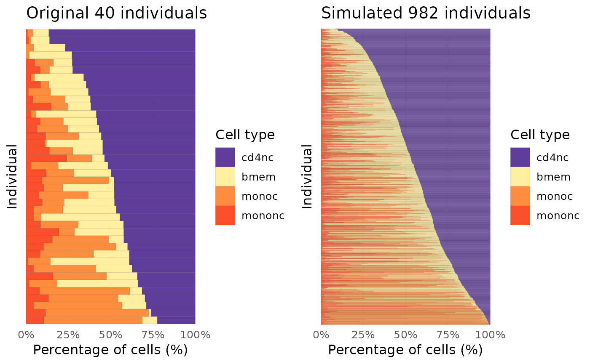

# Model cell type proportions for new individuals

## Introduction

scDesignPop provide modeling of the cell type proportions for generating
new cell type proportions for new simulated individuals. The default
covariates used are the PCs of the genotypes, which we will show in the
following tutorial.

## Library and data preparation

Here, we load the `example_sce` data with both the genotype PCs of the
training `example_sce` data and those of the new simulated individuals.

``` r
library(SingleCellExperiment)
library(scDesignPop)
library(dplyr)
data("example_sce")
data("example_genopc_train")
data("example_genopc_new")
othercov_new <- select(example_genopc_new, indiv)

head(example_genopc_train)
#> # A tibble: 6 × 31
#>   indiv      PC1      PC2       PC3      PC4       PC5     PC6      PC7      PC8
#>   <chr>    <dbl>    <dbl>     <dbl>    <dbl>     <dbl>   <dbl>    <dbl>    <dbl>
#> 1 SAMP1  0.00988  0.0240   0.0552   -0.00774 -0.0239    0.0380  0.00775 -0.0179 
#> 2 SAMP2 -0.0217  -0.00495  0.00717  -0.0191   0.000858  0.0210 -0.00205 -0.0159 
#> 3 SAMP3  0.00503  0.0103  -0.00238  -0.0363   0.00505  -0.0245  0.0645  -0.0149 
#> 4 SAMP4 -0.0410   0.0297  -0.0341    0.0263  -0.0249    0.0171 -0.00949 -0.00863
#> 5 SAMP5 -0.00978  0.0294   0.0504   -0.0194  -0.0179    0.0368  0.0135   0.0115 
#> 6 SAMP6 -0.0212  -0.0106  -0.000811 -0.0106   0.0300    0.0547  0.00962 -0.0380 
#> # ℹ 22 more variables: PC9 <dbl>, PC10 <dbl>, PC11 <dbl>, PC12 <dbl>,
#> #   PC13 <dbl>, PC14 <dbl>, PC15 <dbl>, PC16 <dbl>, PC17 <dbl>, PC18 <dbl>,
#> #   PC19 <dbl>, PC20 <dbl>, PC21 <dbl>, PC22 <dbl>, PC23 <dbl>, PC24 <dbl>,
#> #   PC25 <dbl>, PC26 <dbl>, PC27 <dbl>, PC28 <dbl>, PC29 <dbl>, PC30 <dbl>
head(example_genopc_new)
#> # A tibble: 6 × 31
#>   indiv        PC1      PC2      PC3      PC4      PC5      PC6      PC7     PC8
#>   <chr>      <dbl>    <dbl>    <dbl>    <dbl>    <dbl>    <dbl>    <dbl>   <dbl>
#> 1 NEW_SA… -0.0167  -4.34e-2 -0.0174  -2.63e-2 -0.0391   1.36e-2  0.00141 -0.0226
#> 2 NEW_SA… -0.0182   2.96e-2 -0.0114  -5.91e-2 -0.0170   6.63e-3 -0.00878 -0.0453
#> 3 NEW_SA… -0.0247  -1.73e-2 -0.00227 -8.02e-4  0.0589  -1.50e-2 -0.0375   0.0260
#> 4 NEW_SA…  0.0199  -4.28e-2 -0.0490   5.99e-2 -0.0323   1.22e-2  0.0627   0.0562
#> 5 NEW_SA…  0.0743  -3.98e-2 -0.0151   3.53e-2 -0.00486  4.28e-2 -0.0277  -0.0236
#> 6 NEW_SA… -0.00289 -8.21e-4 -0.0423   6.06e-4  0.0245  -9.70e-4 -0.0200  -0.0487
#> # ℹ 22 more variables: PC9 <dbl>, PC10 <dbl>, PC11 <dbl>, PC12 <dbl>,
#> #   PC13 <dbl>, PC14 <dbl>, PC15 <dbl>, PC16 <dbl>, PC17 <dbl>, PC18 <dbl>,
#> #   PC19 <dbl>, PC20 <dbl>, PC21 <dbl>, PC22 <dbl>, PC23 <dbl>, PC24 <dbl>,
#> #   PC25 <dbl>, PC26 <dbl>, PC27 <dbl>, PC28 <dbl>, PC29 <dbl>, PC30 <dbl>
```

## Celltype proportion modeling

We model the cell type proportions with a Multinomial model using
genotype PCs as covariates. We also model the total cell number per
individuals with a log-normal distribution. Here, `indiv_colname` is
used to specify the shared column name for individual ids in both the
`colData(example_sce)` and `genopc_train`. We use `celltype_colname` to
specify the column name for the cell states or cell types in
`colData(example_sce)`. Here, we input `othercov_new` to specify
individual ids of the simulated test data.

``` r
set.seed(123)
simu_cellprop_list <- simuCellProportion(
  sce = example_sce,
  genoPC = example_genopc_train,
  new_genoPC = example_genopc_new,
  new_othercov = othercov_new,
  PCnum = 30L,
  indiv_colname = "indiv",
  celltype_colname = "cell_type",
  cn_model_family = "lognormal",    # cell number model
  cp_model_family = "MN",  # cell proportion model
  cp_intercept = TRUE
)
```

## Showing the covariates for new individuals

The covariates including the cell types for the new simulated
individuals will be contained in the following data frame, which can be
given to the `new_covariate` parameter in function
[`constructDataPop()`](https://chrisycd.github.io/scDesignPop/reference/constructDataPop.md).

``` r
head(simu_cellprop_list[["simu_cov"]])
#>                    cell_type     indiv
#> simcell1_NEW_SAMP1      bmem NEW_SAMP1
#> simcell2_NEW_SAMP1      bmem NEW_SAMP1
#> simcell3_NEW_SAMP1      bmem NEW_SAMP1
#> simcell4_NEW_SAMP1      bmem NEW_SAMP1
#> simcell5_NEW_SAMP1      bmem NEW_SAMP1
#> simcell6_NEW_SAMP2      bmem NEW_SAMP2
```

## Visualizing the cell type proportion structures

By specifying the colors for each cell type, we can visualize the cell
type proportion structure between the original data and simulated data
after ordering individuals with the cell number of the first cell type.
If no colors are specified for cell types, the function will still plot
the data using the R default colors and ordering individuals based on
the cell number of the first cell type after factorizing the cell types
of the given data.

``` r
library(cowplot)
color_vec <- c(
  "cd4nc"   = "#5E3C99",
  "bmem"    = "#FFEDA0",
  "monoc"   = "#FD8D3C",
  "mononc"  = "#FC4E2A"
)


p1 <- plotCellProp(colData(example_sce), 
                   title = "Original 40 individuals",
                   color_vec = color_vec, 
                   celltype_colname = "cell_type",
                   indiv_colname = "indiv",
                   width = 1, linewidth = 0.02)

p2 <- plotCellProp(simu_cellprop_list[["simu_cov"]], 
                   title = "Simulated 982 individuals",
                   color_vec = color_vec, 
                   celltype_colname = "cell_type",
                   indiv_colname = "indiv",
                   width = 1, linewidth = 0.01)


cowplot::plot_grid(p1, p2)
```



## Session information

``` r
sessionInfo()
#> R version 4.2.3 (2023-03-15)
#> Platform: x86_64-pc-linux-gnu (64-bit)
#> Running under: Ubuntu 22.04.5 LTS
#> 
#> Matrix products: default
#> BLAS:   /usr/lib/x86_64-linux-gnu/openblas-pthread/libblas.so.3
#> LAPACK: /usr/lib/x86_64-linux-gnu/openblas-pthread/libopenblasp-r0.3.20.so
#> 
#> locale:
#>  [1] LC_CTYPE=en_US.UTF-8       LC_NUMERIC=C              
#>  [3] LC_TIME=en_US.UTF-8        LC_COLLATE=en_US.UTF-8    
#>  [5] LC_MONETARY=en_US.UTF-8    LC_MESSAGES=en_US.UTF-8   
#>  [7] LC_PAPER=en_US.UTF-8       LC_NAME=C                 
#>  [9] LC_ADDRESS=C               LC_TELEPHONE=C            
#> [11] LC_MEASUREMENT=en_US.UTF-8 LC_IDENTIFICATION=C       
#> 
#> attached base packages:
#> [1] stats4    stats     graphics  grDevices utils     datasets  methods  
#> [8] base     
#> 
#> other attached packages:
#>  [1] cowplot_1.1.3               dplyr_1.1.4                
#>  [3] scDesignPop_0.0.0.9012      SingleCellExperiment_1.20.1
#>  [5] SummarizedExperiment_1.28.0 Biobase_2.58.0             
#>  [7] GenomicRanges_1.50.2        GenomeInfoDb_1.34.9        
#>  [9] IRanges_2.32.0              S4Vectors_0.36.2           
#> [11] BiocGenerics_0.44.0         MatrixGenerics_1.10.0      
#> [13] matrixStats_1.1.0           BiocStyle_2.26.0           
#> 
#> loaded via a namespace (and not attached):
#>  [1] sass_0.4.10            jsonlite_2.0.0         splines_4.2.3         
#>  [4] bslib_0.9.0            assertthat_0.2.1       MGLM_0.2.1            
#>  [7] BiocManager_1.30.25    GenomeInfoDbData_1.2.9 yaml_2.3.10           
#> [10] numDeriv_2016.8-1.1    pillar_1.10.2          lattice_0.22-6        
#> [13] glue_1.8.0             digest_0.6.37          RColorBrewer_1.1-3    
#> [16] XVector_0.38.0         glmmTMB_1.1.9          minqa_1.2.8           
#> [19] htmltools_0.5.8.1      Matrix_1.6-5           pkgconfig_2.0.3       
#> [22] bookdown_0.43          zlibbioc_1.44.0        scales_1.4.0          
#> [25] lme4_1.1-35.3          tibble_3.2.1           mgcv_1.9-1            
#> [28] generics_0.1.4         farver_2.1.2           ggplot2_3.5.2         
#> [31] cachem_1.1.0           withr_3.0.2            TMB_1.9.11            
#> [34] cli_3.6.5              magrittr_2.0.3         evaluate_1.0.3        
#> [37] fs_1.6.6               nlme_3.1-164           MASS_7.3-58.2         
#> [40] textshaping_0.4.0      tools_4.2.3            lifecycle_1.0.4       
#> [43] DelayedArray_0.24.0    irlba_2.3.5.1          compiler_4.2.3        
#> [46] pkgdown_2.2.0          jquerylib_0.1.4        systemfonts_1.2.3     
#> [49] rlang_1.1.6            grid_4.2.3             RCurl_1.98-1.17       
#> [52] nloptr_2.2.1           rstudioapi_0.17.1      htmlwidgets_1.6.4     
#> [55] labeling_0.4.3         bitops_1.0-9           rmarkdown_2.27        
#> [58] boot_1.3-30            gtable_0.3.6           R6_2.6.1              
#> [61] knitr_1.50             fastmap_1.2.0          uwot_0.2.3            
#> [64] utf8_1.2.5             ragg_1.5.0             desc_1.4.3            
#> [67] parallel_4.2.3         Rcpp_1.0.14            vctrs_0.6.5           
#> [70] tidyselect_1.2.1       xfun_0.52
```
