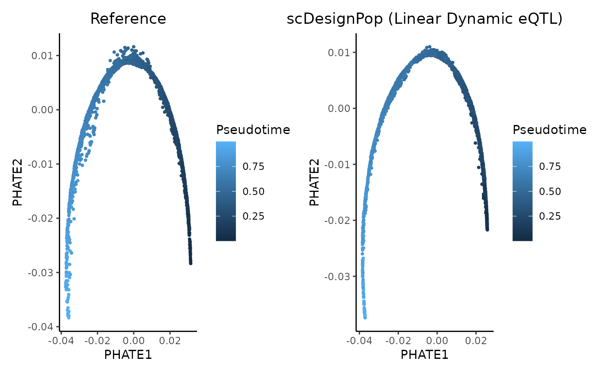

# Model linear dynamic eQTL effects in continuous cell states

``` r
library(scDesignPop)
library(SingleCellExperiment)
library(SummarizedExperiment)
library(scater)
theme_set(theme_bw())
```

## Step 1: construct a data list

scDesignPop can also be extended to other eQTL effects. Here we show how
scDesignPop can model dynamic eQTL effects in continuous cell states as
potential in-silico ground-truth. We only consider linear dynamic eQTL
effects here for simplicity. To run scDesignPop, a list of data is
required as input. This is done using the `constructDataPop` function. A
`SingleCellExperiment` object and an `eqtlgeno` dataframe are the two
main inputs needed. The `eqtlgeno` dataframe consists of eQTL
annotations (it must have cell state, gene, SNP, chromosome, and
position columns at a minimum), and genotypes across individuals
(columns) for every SNP (rows). The structure of an example `eqtlgeno`
dataframe is given below. Here, we use a subset of the B cells from
OneK1K cohort as example.

``` r
data("example_sce_Bcell")
data("example_eqtlgeno_Bcell")
```

``` r
data_list <- constructDataPop(
    sce = example_sce_Bcell,
    eqtlgeno_df = example_eqtlgeno_Bcell,
    new_covariate = as.data.frame(colData(example_sce_Bcell)),
    overlap_features = NULL,
    sampid_vec = NULL,
    copula_variable = "slingPseudotime_1",
    n_quantiles = 10,
    slot_name = "counts",
    snp_model = "single",
    time_colname = "slingPseudotime_1",
    celltype_colname = "cell_type",
    feature_colname = "gene_id",
    snp_colname = "snp_id",
    loc_colname = "POS",
    chrom_colname = "CHR",
    indiv_colname = "indiv",
    prune_thres = 0.9
    )
```

## Step 2: fit marginal model

Next, a marginal model is specified to fit each gene using the
`fitMarginalPop` function.  
Here we use a Negative Binominal as the parametric model using `"nb"`.

``` r
marginal_list <- fitMarginalPop(
    data_list = data_list,
    mean_formula = "(1|indiv) + slingPseudotime_1",
    model_family = "nb",
    interact_colnames = c("slingPseudotime_1"),
    parallelization = "pbmcapply",
    n_threads = 20L,
    loc_colname = "POS",
    snp_colname = "snp_id",
    celltype_colname = "cell_type",
    indiv_colname = "indiv",
    filter_snps = TRUE,
    snpvar_thres = 0,
    force_formula = FALSE,
    data_maxsize = 1
    )
```

## Step 3: fit a Gaussian copula

The third step is to fit a Gaussian copula using the `fitCopulaPop`
function.

``` r
set.seed(123, kind = "L'Ecuyer-CMRG")

copula_fit <- fitCopulaPop(
    sce = example_sce_Bcell,
    assay_use = "counts",
    input_data = data_list[["new_covariate"]],
    marginal_list = marginal_list,
    family_use = "nb",
    copula = "gaussian",
    n_cores = 2L,
    parallelization = "mcmapply"
    )

RNGkind("Mersenne-Twister")  # reset
```

## Step 4: extract parameters

The fourth step is to compute the mean, sigma, and zero probability
parameters using the `extractParaPop` function.

``` r
para_new <- extractParaPop(
    sce = example_sce_Bcell,
    assay_use = "counts",
    marginal_list = marginal_list,
    n_cores = 2L,
    family_use = "nb",
    indiv_colname = "indiv",
    new_covariate = data_list[["new_covariate"]],
    new_eqtl_geno_list = data_list[["eqtl_geno_list"]],
    data = data_list[["covariate"]],
    parallelization = "pbmcmapply"
    )
```

## Step 5: simulate counts

The fifth step is to simulate counts using the `simuNewPop` function.

``` r
set.seed(123)

newcount_mat <- simuNewPop(
    sce = example_sce_Bcell,
    mean_mat = para_new[["mean_mat"]],
    sigma_mat = para_new[["sigma_mat"]],
    zero_mat = para_new[["zero_mat"]],
    quantile_mat = NULL,
    copula_list = copula_fit[["copula_list"]],
    n_cores = 2L,
    family_use = "nb",
    nonnegative = TRUE,
    input_data = data_list[["covariate"]],
    new_covariate = data_list[["new_covariate"]],
    important_feature = copula_fit[["important_feature"]],
    filtered_gene = data_list[["filtered_gene"]],
    parallelization = "pbmcmapply"
    )
```

## Step 6: create SingleCellExperiment object using simulated data

After simulating the data, we can create a `SingleCellExperiment` object
as follows.

``` r
simu_sce_Bcell <- SingleCellExperiment(list(counts = newcount_mat), 
                                       colData = data_list[["new_covariate"]])
names(assays(simu_sce_Bcell)) <- "counts"

# save gene meta data
rowData(simu_sce_Bcell) <- rowData(example_sce_Bcell)
```

## Step 7: visualize using PHATE

The simulated data can be visualized using a UMAP plot as follows.

``` r
library(ggplot2)
library(phateR)

# run PHATE for reference data
ph <- phate(t(counts(example_sce_Bcell)))
#> Calculating PHATE...
#>   Running PHATE on 3726 observations and 817 variables.
#>   Calculating graph and diffusion operator...
#>     Calculating PCA...
#>     Calculated PCA in 0.28 seconds.
#>     Calculating KNN search...
#>     Calculated KNN search in 0.98 seconds.
#>     Calculating affinities...
#>     Calculated affinities in 0.02 seconds.
#>   Calculated graph and diffusion operator in 1.28 seconds.
#>   Calculating landmark operator...
#>     Calculating SVD...
#>     Calculated SVD in 0.22 seconds.
#>     Calculating KMeans...
#>     Calculated KMeans in 3.23 seconds.
#>   Calculated landmark operator in 3.89 seconds.
#>   Calculating optimal t...
#>     Automatically selected t = 18
#>   Calculated optimal t in 0.74 seconds.
#>   Calculating diffusion potential...
#>   Calculated diffusion potential in 0.13 seconds.
#>   Calculating metric MDS...
#>   Calculated metric MDS in 3.67 seconds.
#> Calculated PHATE in 9.71 seconds.
reducedDims(example_sce_Bcell) <- SimpleList(PHATE = ph$embedding)

# run PHATE for simulated data
ph_simu <- phate(t(counts(simu_sce_Bcell)))
#> Calculating PHATE...
#>   Running PHATE on 3726 observations and 817 variables.
#>   Calculating graph and diffusion operator...
#>     Calculating PCA...
#>     Calculated PCA in 0.26 seconds.
#>     Calculating KNN search...
#>     Calculated KNN search in 0.87 seconds.
#>     Calculating affinities...
#>     Calculated affinities in 0.02 seconds.
#>   Calculated graph and diffusion operator in 1.16 seconds.
#>   Calculating landmark operator...
#>     Calculating SVD...
#>     Calculated SVD in 0.22 seconds.
#>     Calculating KMeans...
#>     Calculated KMeans in 3.49 seconds.
#>   Calculated landmark operator in 4.18 seconds.
#>   Calculating optimal t...
#>     Automatically selected t = 15
#>   Calculated optimal t in 0.72 seconds.
#>   Calculating diffusion potential...
#>   Calculated diffusion potential in 0.14 seconds.
#>   Calculating metric MDS...
#>   Calculated metric MDS in 3.57 seconds.
#> Calculated PHATE in 9.77 seconds.
reducedDims(simu_sce_Bcell) <- SimpleList(PHATE = ph_simu$embedding)

# visualize
p <- ggplot(reducedDim(example_sce_Bcell), 
            aes(PHATE1, PHATE2, color = example_sce_Bcell$slingPseudotime_1)) +
  ggrastr::rasterise(
    geom_point(size = 0.5),
    dpi = 300
  ) +
  labs(color = "Pseudotime") +
  theme_classic() +
  theme(plot.title = element_text(hjust = 0.5)) + 
    ggtitle("Reference")

p_simu <- ggplot(reducedDim(simu_sce_Bcell), 
                 aes(PHATE1, PHATE2, 
                     color = colData(simu_sce_Bcell)$slingPseudotime_1)) +
  ggrastr::rasterise(
    geom_point(size = 0.5),
    dpi = 300
  ) +
  labs(color = "Pseudotime") +
  theme_classic() +
  theme(plot.title = element_text(hjust = 0.5)) + 
    ggtitle("scDesignPop (Linear Dynamic eQTL)")

patchwork::wrap_plots(p, p_simu, ncol = 2)
```



## Session information

``` r
sessionInfo()
#> R version 4.2.3 (2023-03-15)
#> Platform: x86_64-pc-linux-gnu (64-bit)
#> Running under: Ubuntu 22.04.5 LTS
#> 
#> Matrix products: default
#> BLAS:   /usr/lib/x86_64-linux-gnu/openblas-pthread/libblas.so.3
#> LAPACK: /usr/lib/x86_64-linux-gnu/openblas-pthread/libopenblasp-r0.3.20.so
#> 
#> locale:
#>  [1] LC_CTYPE=en_US.UTF-8       LC_NUMERIC=C              
#>  [3] LC_TIME=en_US.UTF-8        LC_COLLATE=en_US.UTF-8    
#>  [5] LC_MONETARY=en_US.UTF-8    LC_MESSAGES=en_US.UTF-8   
#>  [7] LC_PAPER=en_US.UTF-8       LC_NAME=C                 
#>  [9] LC_ADDRESS=C               LC_TELEPHONE=C            
#> [11] LC_MEASUREMENT=en_US.UTF-8 LC_IDENTIFICATION=C       
#> 
#> attached base packages:
#> [1] stats4    stats     graphics  grDevices utils     datasets  methods  
#> [8] base     
#> 
#> other attached packages:
#>  [1] phateR_1.0.7                Matrix_1.6-5               
#>  [3] scater_1.26.1               ggplot2_3.5.2              
#>  [5] scuttle_1.8.4               SingleCellExperiment_1.20.1
#>  [7] SummarizedExperiment_1.28.0 Biobase_2.58.0             
#>  [9] GenomicRanges_1.50.2        GenomeInfoDb_1.34.9        
#> [11] IRanges_2.32.0              S4Vectors_0.36.2           
#> [13] BiocGenerics_0.44.0         MatrixGenerics_1.10.0      
#> [15] matrixStats_1.1.0           scDesignPop_0.0.0.9006     
#> [17] BiocStyle_2.26.0           
#> 
#> loaded via a namespace (and not attached):
#>   [1] ggbeeswarm_0.7.2          minqa_1.2.8              
#>   [3] rprojroot_2.1.1           XVector_0.38.0           
#>   [5] BiocNeighbors_1.16.0      fs_1.6.6                 
#>   [7] rstudioapi_0.17.1         glmmTMB_1.1.13           
#>   [9] farver_2.1.2              ggrepel_0.9.5            
#>  [11] mvtnorm_1.3-3             codetools_0.2-20         
#>  [13] splines_4.2.3             sparseMatrixStats_1.10.0 
#>  [15] cachem_1.1.0              knitr_1.50               
#>  [17] jsonlite_2.0.0            nloptr_2.2.1             
#>  [19] Cairo_1.6-2               RhpcBLASctl_0.23-42      
#>  [21] png_0.1-8                 uwot_0.2.3               
#>  [23] BiocManager_1.30.25       compiler_4.2.3           
#>  [25] assertthat_0.2.1          fastmap_1.2.0            
#>  [27] cli_3.6.5                 BiocSingular_1.14.0      
#>  [29] htmltools_0.5.8.1         tools_4.2.3              
#>  [31] rsvd_1.0.5                gtable_0.3.6             
#>  [33] glue_1.8.0                GenomeInfoDbData_1.2.9   
#>  [35] dplyr_1.1.4               rappdirs_0.3.3           
#>  [37] Rcpp_1.0.14               jquerylib_0.1.4          
#>  [39] pkgdown_2.2.0             vctrs_0.6.5              
#>  [41] nlme_3.1-164              DelayedMatrixStats_1.20.0
#>  [43] xfun_0.52                 rbibutils_2.3            
#>  [45] beachmat_2.14.2           lme4_1.1-35.3            
#>  [47] lifecycle_1.0.4           irlba_2.3.5.1            
#>  [49] zlibbioc_1.44.0           MASS_7.3-58.2            
#>  [51] zoo_1.8-14                scales_1.4.0             
#>  [53] ragg_1.5.0                parallel_4.2.3           
#>  [55] sandwich_3.1-1            TMB_1.9.11               
#>  [57] RColorBrewer_1.1-3        yaml_2.3.10              
#>  [59] memoise_2.0.1             reticulate_1.42.0        
#>  [61] pbapply_1.7-2             gridExtra_2.3            
#>  [63] ggrastr_1.0.2             sass_0.4.10              
#>  [65] desc_1.4.3                ScaledMatrix_1.6.0       
#>  [67] boot_1.3-30               BiocParallel_1.32.6      
#>  [69] Rdpack_2.6.4              rlang_1.1.6              
#>  [71] pkgconfig_2.0.3           systemfonts_1.2.3        
#>  [73] bitops_1.0-9              evaluate_1.0.3           
#>  [75] lattice_0.22-6            labeling_0.4.3           
#>  [77] patchwork_1.2.0           htmlwidgets_1.6.4        
#>  [79] tidyselect_1.2.1          here_1.0.1               
#>  [81] magrittr_2.0.3            bookdown_0.43            
#>  [83] R6_2.6.1                  reformulas_0.4.1         
#>  [85] generics_0.1.4            DelayedArray_0.24.0      
#>  [87] pillar_1.10.2             withr_3.0.2              
#>  [89] mgcv_1.9-1                RCurl_1.98-1.17          
#>  [91] tibble_3.2.1              rmarkdown_2.27           
#>  [93] viridis_0.6.5             grid_4.2.3               
#>  [95] digest_0.6.37             pbmcapply_1.5.1          
#>  [97] numDeriv_2016.8-1.1       textshaping_0.4.0        
#>  [99] beeswarm_0.4.0            viridisLite_0.4.2        
#> [101] vipor_0.4.7               bslib_0.9.0
```
