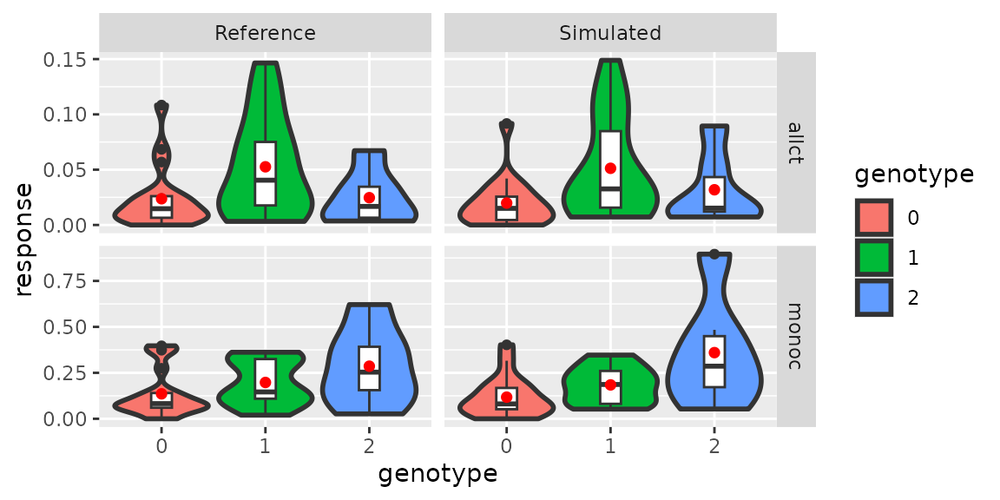
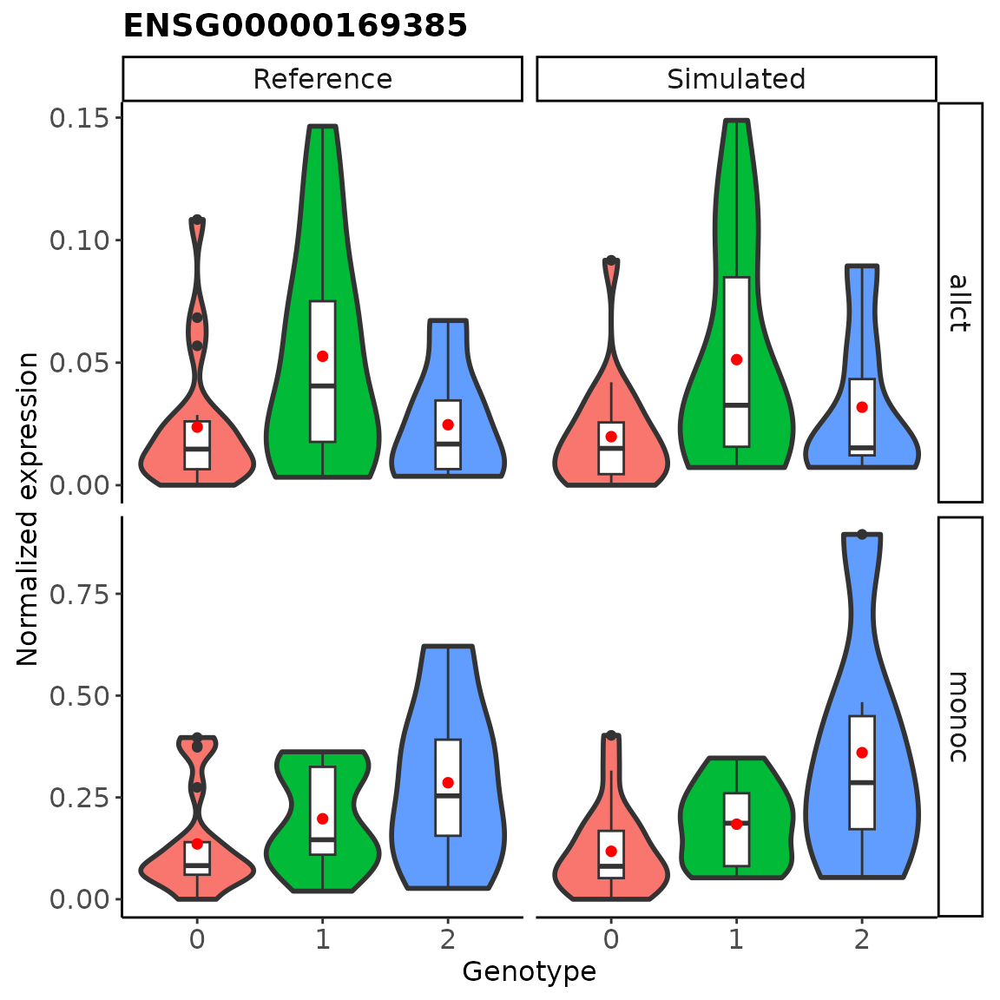

# Modify eQTL effect for eGenes / non-eGenes

## Introduction

scDesignPop enables users to modify the estimated cell-type-specific
eQTL effect sizes and generate realistic scRNA-seq data with altered
ground truths. Such data allow downstream tasks such as systematic
benchmarking various eQTL mapping methods with different ground truths.

## Load libraries and data

Here, we use an example SingleCellExperiment object `example_sce` with
$982$ genes and $7998$ cells and an example eQTL genotype dataframe
`example_eqtlgeno` to demonstrate the tutorial. These two objects
contains the gene expression and SNP genotypes of $40$ anonymized
individuals while the eQTL genotype dataframe provides $2792$ putative
cell-type-specific eQTLs.

``` r
library(scDesignPop)
library(SingleCellExperiment)
library(SummarizedExperiment)
library(ggplot2)

data("example_sce")
data("example_eqtlgeno")
```

## Model fitting

### Step 1: construct a data list

To run scDesignPop, a list of data is required as input. This is done
using the `constructDataPop` function. A `SingleCellExperiment` object
and an `eqtlgeno` dataframe are the two main inputs needed. The
`eqtlgeno` dataframe consists of eQTL annotations (it must have cell
state, gene, SNP, chromosome, and position columns at a minimum), and
genotypes across individuals (columns) for every SNP (rows). The
structure of an example `eqtlgeno` dataframe is given below.

``` r
data_list <- constructDataPop(
    sce = example_sce,
    eqtlgeno_df = example_eqtlgeno,
    new_covariate = as.data.frame(colData(example_sce)),
    copula_variable = "cell_type",
    slot_name = "counts",
    snp_mode = "single"
    )
#> slot_name argument is deprecated and will be removed in a future update.Please use assay_use instead.
#> Constructing eqtlgeno list...
```

### Step 2: fit marginal model

Next, a marginal model is specified to fit each gene using the
`fitMarginalPop` function.  
Here we use a Negative Binominal mixed model using `"nb"` option. We
specify `"(1|indiv) + cell_type"` for the mean formula, where
`(1|indiv)` specifies the random intercept using `indiv` as variable.

``` r
marginal_list <- fitMarginalPop(
    data_list = data_list,
    mean_formula = "(1|indiv) + cell_type",
    model_family = "nb",
    interact_colnames = "cell_type",
    parallelization = "parallel",
    n_threads = 20L
    )
#> n_threads argument is deprecated and will be removed in a future update.Please use n_cores instead.
```

### Step 3: fit a Gaussian copula

The third step is to fit a Gaussian copula using the `fitCopulaPop`
function.

``` r
set.seed(123, kind = "L'Ecuyer-CMRG")

copula_fit <- fitCopulaPop(
    sce = example_sce,
    assay_use = "counts",
    input_data = data_list[["covariate"]],
    marginal_list = marginal_list,
    family_use = "nb",
    copula = "gaussian",
    n_cores = 2L,
    parallelization = "parallel"
    )
#> Convert Residuals to Multivariate Gaussian
#> Converting End
#> Copula group 1 starts
#> Copula group 3 starts
#> Copula group 4 starts
#> Copula group 2 starts

RNGkind("Mersenne-Twister")  # reset
```

### Step 4. modify cell-typse-specific eQTL effect

To define a cell-type-specific eQTL gene (eGene), we modify modify the
fitted parameters using the `modifyMarginalModels` function. Here, we
increase the cell-type-specific eQTL effect size for `ENSG00000169385`
gene by a $\log 2$-fold-change relative to the fitted value using
`eqtl_log2fc = 2` in `monoc` cell type.

``` r
marginal_mod <- modifyMarginalModels(
    marginal_list = marginal_list,
    eqtlgeno_list = data_list[["eqtl_geno_list"]],
    features = "ENSG00000169385",
    celltype = "monoc",
    eqtl_log2fc = 2,
    mod_scale = "link"
    )
#> Modifying parameters for ENSG00000169385 in monoc celltype...
#> Per-allele link-scale eQTL effect: 0.31073 ===> 1.24294
#> celltype effect: 36.65121 ===> new value: 35.71900
#> interaction effect: -16.10368 ===> new value: -15.17148
#> conditional means at geno 0,1,2: 0.18964, 0.25875, 0.35305 ===> 0.07466, 0.25875, 0.89679
#> eQTL slope between geno 1 and 0: 0.06911 ===> new value: 0.18409
#> Phi parameter: 0.48371 ===> new value: 0.48371
```

### Step 5: extract parameters

The fifth step is to compute the mean, sigma, and zero probability
parameters using the `extractParaPop` function.

``` r
para_new <- extractParaPop(
    sce = example_sce,
    assay_use = "counts",
    marginal_list = marginal_mod[["marginal_list"]],
    n_cores = 8L,
    family_use = "nb",
    new_covariate = data_list[["new_covariate"]],
    new_eqtl_geno_list = data_list[["eqtl_geno_list"]],
    data = data_list[["covariate"]],
    parallelization = "parallel"
    )
```

### Step 6: simulate counts

The sixth step is to simulate counts using the `simuNewPop` function.

``` r
set.seed(123, kind = "L'Ecuyer-CMRG")

newcount_mat <- simuNewPop(
    sce = example_sce,
    mean_mat = para_new[["mean_mat"]],
    sigma_mat = para_new[["sigma_mat"]],
    zero_mat = para_new[["zero_mat"]],
    copula_list = copula_fit[["copula_list"]],
    n_cores = 2L,
    family_use = "nb",
    input_data = data_list[["covariate"]],
    new_covariate = data_list[["new_covariate"]],
    important_feature = copula_fit[["important_feature"]],
    filtered_gene = data_list[["filtered_gene"]],
    parallelization = "parallel"
    )
#> Use Copula to sample a multivariate quantile matrix
#> Sample Copula group 1 starts
#> Sample Copula group 3 starts
#> Sample Copula group 4 starts
#> Sample Copula group 2 starts

RNGkind("Mersenne-Twister")  # reset
```

### Step 7: create SingleCellExperiment object using simulated data

After simulating the data, we create a `SingleCellExperiment` object as
follows.

``` r
simu_sce <- SingleCellExperiment(list(counts = newcount_mat),
                                 colData = data_list[["new_covariate"]])
```

## Create pseudobulk expression data

To create pseudobulk data, we first define a named list with the SCE
objects of interest. Here we name `example_sce` as “Reference”, and the
simulated SCE object with modified effect size as “Simulated”.

``` r
sce_list <- list("Reference" = example_sce,
                 "Simulated" = simu_sce)
```

Next, we normalize each SCE object in the data using `log1p` and then
aggregate using `mean`. This can be done in one step using the
`createPbulkExprGeno` function.

We also specify the all cells (denoted as `"allct"`), and the cell type
that we wish to visualize with `c("allct", "monoc")`. The SNP loci
specified correspond to the cell types in the same order.

``` r
res_list <- createPbulkExprGeno(sce_list = sce_list,
                                eqtlgeno = example_eqtlgeno,
                                feature_sel = "ENSG00000169385",
                                celltype_sel = c("allct", "monoc"),
                                eqtl_snp = c("14:21359808", "14:21359808"),
                                normalize_type = "log1p",
                                aggregate_type = "mean",
                                slot_name = "logcounts",
                                overwrite = TRUE,
                                if_plot = TRUE)
#> eqtl_snp input used to override eqtl_indx...
#> 1 cell types use this SNP:
#>   monoc 
#> Selected 14:21359808 snp for allct celltype, ENSG00000169385 feature.
#> 1 cell types use this SNP:
#>   monoc 
#> Selected 14:21359808 snp for monoc celltype, ENSG00000169385 feature.
```

One of the objects, `res_df`, in the output list is a dataframe with
each row containing the pseudobulk values corresponding to each
individual and their genotypes, along with other important columns such
as cell types, aggregation used, normalization used, etc.

``` r
head(res_list[["res_df"]])
#> # A tibble: 6 × 10
#>   indiv  response genotype gene_id       cell_type snp_id sce_name normalization
#>   <chr>     <dbl> <fct>    <chr>         <chr>     <chr>  <chr>    <chr>        
#> 1 SAMP30  0.0569  0        ENSG00000169… allct     14:21… Referen… log1p        
#> 2 SAMP36  0.00636 0        ENSG00000169… allct     14:21… Referen… log1p        
#> 3 SAMP33  0.0584  1        ENSG00000169… allct     14:21… Referen… log1p        
#> 4 SAMP37  0.00700 0        ENSG00000169… allct     14:21… Referen… log1p        
#> 5 SAMP34  0.0225  1        ENSG00000169… allct     14:21… Referen… log1p        
#> 6 SAMP38  0.0198  0        ENSG00000169… allct     14:21… Referen… log1p        
#> # ℹ 2 more variables: aggregate_type <chr>, slot_used <chr>
```

## Visualize pseudobulk expression

Next, we show the pseudobulk expression versus genotype using violin
plots across the two SCE objects and the cell types using the ggplot
object, `p_pbulk`, generated in the output list. Each violin plot has a
boxplot within and the mean marked by a red dot.

``` r
res_list[["p_pbulk"]]
```



Alternatively, users may customize the plot using additional `ggplot2`
commands or generate their own plot directly using the `res_df`
dataframe. We leave the latter part out of this tutorial.

``` r
res_list[["p_pbulk"]] +
    theme_classic() +
    labs(title = "ENSG00000169385",
                  y = "Normalized expression",
                  x = "Genotype") +
    theme(
        plot.title = element_text(size = 14, hjust = 0,  # left title
                                  face = "bold"),
        axis.text = element_text(size = 12),
        axis.title = element_text(size = 12),
        strip.text = element_text(size = 12),  # facet font size
        aspect.ratio = 1,
        legend.position = "none"
    )
```



## Session information

``` r
sessionInfo()
#> R version 4.2.3 (2023-03-15)
#> Platform: x86_64-pc-linux-gnu (64-bit)
#> Running under: Ubuntu 22.04.5 LTS
#> 
#> Matrix products: default
#> BLAS:   /usr/lib/x86_64-linux-gnu/openblas-pthread/libblas.so.3
#> LAPACK: /usr/lib/x86_64-linux-gnu/openblas-pthread/libopenblasp-r0.3.20.so
#> 
#> locale:
#>  [1] LC_CTYPE=en_US.UTF-8       LC_NUMERIC=C              
#>  [3] LC_TIME=en_US.UTF-8        LC_COLLATE=en_US.UTF-8    
#>  [5] LC_MONETARY=en_US.UTF-8    LC_MESSAGES=en_US.UTF-8   
#>  [7] LC_PAPER=en_US.UTF-8       LC_NAME=C                 
#>  [9] LC_ADDRESS=C               LC_TELEPHONE=C            
#> [11] LC_MEASUREMENT=en_US.UTF-8 LC_IDENTIFICATION=C       
#> 
#> attached base packages:
#> [1] stats4    stats     graphics  grDevices utils     datasets  methods  
#> [8] base     
#> 
#> other attached packages:
#>  [1] ggplot2_3.5.2               SingleCellExperiment_1.20.1
#>  [3] SummarizedExperiment_1.28.0 Biobase_2.58.0             
#>  [5] GenomicRanges_1.50.2        GenomeInfoDb_1.34.9        
#>  [7] IRanges_2.32.0              S4Vectors_0.36.2           
#>  [9] BiocGenerics_0.44.0         MatrixGenerics_1.10.0      
#> [11] matrixStats_1.1.0           scDesignPop_0.0.0.9012     
#> [13] BiocStyle_2.26.0           
#> 
#> loaded via a namespace (and not attached):
#>  [1] tidyr_1.3.1            sass_0.4.10            jsonlite_2.0.0        
#>  [4] splines_4.2.3          bslib_0.9.0            assertthat_0.2.1      
#>  [7] BiocManager_1.30.25    GenomeInfoDbData_1.2.9 yaml_2.3.10           
#> [10] numDeriv_2016.8-1.1    pillar_1.10.2          lattice_0.22-6        
#> [13] glue_1.8.0             digest_0.6.37          RColorBrewer_1.1-3    
#> [16] XVector_0.38.0         glmmTMB_1.1.9          minqa_1.2.8           
#> [19] htmltools_0.5.8.1      Matrix_1.6-5           pkgconfig_2.0.3       
#> [22] bookdown_0.43          zlibbioc_1.44.0        purrr_1.0.4           
#> [25] mvtnorm_1.3-3          scales_1.4.0           lme4_1.1-35.3         
#> [28] tibble_3.2.1           mgcv_1.9-1             generics_0.1.4        
#> [31] farver_2.1.2           cachem_1.1.0           withr_3.0.2           
#> [34] pbapply_1.7-2          TMB_1.9.11             cli_3.6.5             
#> [37] magrittr_2.0.3         evaluate_1.0.3         fs_1.6.6              
#> [40] nlme_3.1-164           MASS_7.3-58.2          textshaping_0.4.0     
#> [43] tools_4.2.3            lifecycle_1.0.4        stringr_1.5.1         
#> [46] DelayedArray_0.24.0    irlba_2.3.5.1          compiler_4.2.3        
#> [49] pkgdown_2.2.0          jquerylib_0.1.4        systemfonts_1.2.3     
#> [52] rlang_1.1.6            grid_4.2.3             RCurl_1.98-1.17       
#> [55] nloptr_2.2.1           rstudioapi_0.17.1      htmlwidgets_1.6.4     
#> [58] labeling_0.4.3         bitops_1.0-9           rmarkdown_2.27        
#> [61] boot_1.3-30            gtable_0.3.6           R6_2.6.1              
#> [64] knitr_1.50             dplyr_1.1.4            utf8_1.2.5            
#> [67] fastmap_1.2.0          uwot_0.2.3             ragg_1.5.0            
#> [70] desc_1.4.3             stringi_1.8.7          parallel_4.2.3        
#> [73] Rcpp_1.0.14            vctrs_0.6.5            tidyselect_1.2.1      
#> [76] xfun_0.52
```
