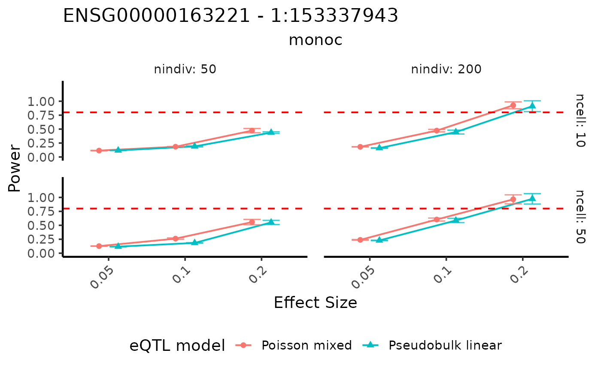
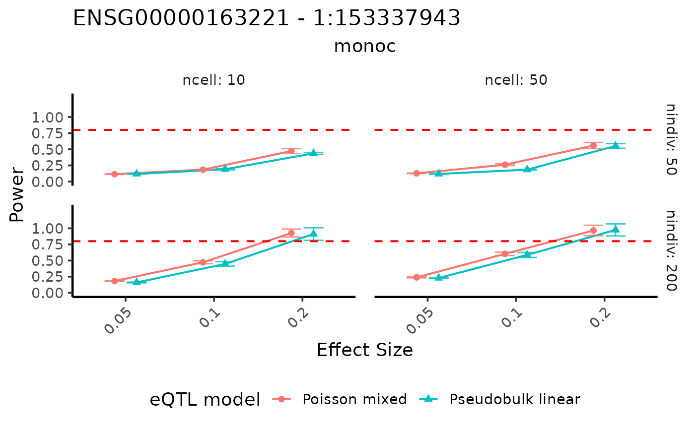

# Power analysis based on user specified eQTL effect sizes

## Introduction

In addition to data simulation, scDesignPop provides tools for
simulation-based power analysis of cell-type-specific eQTL effects. This
allows users to evaluate how study design and eQTL effect sizes
influence the ability to detect eQTL signals.

In this tutorial, we demonstrate how to: - fit marginal models for
selected genes  
- specify cell-type-specific eQTL effect sizes  
- evaluate statistical power under different experimental designs  
- visualize power curves across scenarios

This workflow is particularly useful for guiding study design and
benchmarking eQTL mapping models under controlled settings.

------------------------------------------------------------------------

## Library and data preparation

We begin by loading the example dataset and selecting a subset of genes
for demonstration. This reduces computational cost while illustrating
the workflow.

``` r
library(scDesignPop)
library(SingleCellExperiment)

data("example_sce")
data("example_eqtlgeno")

example_sce_sel <- example_sce[c("ENSG00000163221","ENSG00000135218"),]

example_eqtlgeno_sel <- example_eqtlgeno[
    which(example_eqtlgeno$gene_id %in% c("ENSG00000163221","ENSG00000135218")),
]
```

We then construct the input data required for modeling. This step
extracts expression, covariates, and genotype information and organizes
them into a unified structure.

``` r
data_list_sel <- constructDataPop(
    sce = example_sce_sel,
    eqtlgeno_df = example_eqtlgeno_sel,
    new_covariate = as.data.frame(colData(example_sce_sel)),
    copula_variable = "cell_type",
    slot_name = "counts",
    snp_mode = "single"
)
```

------------------------------------------------------------------------

## Fit marginal models

We next fit marginal models for each gene using `fitMarginalPop`. These
models describe how gene expression depends on covariates and genotype,
and serve as the basis for downstream power analysis.

Here, we use a negative binomial model and include both individual-level
random effects and cell-type effects.

``` r
marginal_list_sel <- fitMarginalPop(
    data_list = data_list_sel,
    mean_formula = "(1|indiv) + cell_type",
    model_family = "nb",
    interact_colnames = "cell_type",
    parallelization = "parallel",
    n_cores = 20L
)
```

------------------------------------------------------------------------

## Perform power analysis

Given fitted marginal models, scDesignPop can perform simulation-based
power analysis for a selected gene–SNP pair using `runPowerAnalysis`.
This function evaluates how often an eQTL is detected under
user-specified effect sizes, study designs, and eQTL mapping models.

In this example, we focus on gene `ENSG00000163221` and SNP
`1:153337943`, and assess power in classical monocytes (`monoc`). The
main arguments define the target cell type, the assumed eQTL effect size
scenarios, the sample-size settings, and the methods (eQTL mapping
models) used for testing.

Several inputs are particularly important:

- `celltype_specific_ES_list` specifies the effect size scenarios to
  evaluate. Each list element corresponds to one scenario and can assign
  effect sizes to one or more cell types.
- `nindivs` and `ncells` specify the number of individuals and cells per
  individual, respectively, determining the study design.
- `methods` specifies the eQTL analysis methods to compare.
- `alpha`, `snp_number`, and `gene_number` determine the significance
  threshold after multiple testing correction.
- `power_nsim` controls the number of simulation replicates used to
  estimate power, while `CI_nsim` and `CI_conf` control the bootstrap
  confidence intervals.

Additional arguments such as `nPool`, `nIndivPerPool`, and
`nCellPerPool` can be used to evaluate pooled sequencing designs when
relevant.

``` r
set.seed(123)

power_data <- runPowerAnalysis(
    marginal_list = marginal_list_sel,
    marginal_model = "nb",
    geneid = "ENSG00000163221",
    snpid = "1:153337943",
    celltype_colname = "cell_type",
    celltype_vector = c("monoc"),
    celltype_specific_ES_list = list(
        c("monoc" = 0.05),
        c("monoc" = 0.1),
        c("monoc" = 0.2)
    ),
    indiv_colname = "indiv",
    methods = c("poisson", "pseudoBulkLinear"),
    nindivs = c(50, 200),
    ncells = c(10, 50),
    alpha = 0.05,
    power_nsim = 1000,
    snp_number = 10,
    gene_number = 800,
    CI_nsim = 1000,
    CI_conf = 0.05,
    n_cores = 25
)
#> [1] 1.920313
#> [1] 0.05
#> [1] 1.920313
#> [1] 0.1
#> [1] 1.920313
#> [1] 0.2
#> [1] 1.920313
#> [1] 0.05
#> [1] 1.920313
#> [1] 0.1
#> [1] 1.920313
#> [1] 0.2
```

------------------------------------------------------------------------

## Visualize power curves

The results can be visualized using `visualizePowerCurve`. This allows
us to examine how power varies as a function of effect size, sample
size, and analysis method.

In the plot below, we visualize power as a function of the specified
effect size, stratified by the number of individuals and cells.

We expect power to increase with larger effect sizes, more individuals,
and more cells per individual.

``` r
visualizePowerCurve(
    power_result = power_data,
    celltype_vector = c("monoc"),
    x_axis = "specifiedES",
    x_facet = "nindiv",
    y_facet = "ncell",
    col_group = "method",
    geneid = "ENSG00000163221",
    snpid = "1:153337943"
)
```



Alternatively, we can swap the faceting variables to view the results
from a different perspective.

``` r
visualizePowerCurve(
    power_result = power_data,
    celltype_vector = c("monoc"),
    x_axis = "specifiedES",
    x_facet = "ncell",
    y_facet = "nindiv",
    col_group = "method",
    geneid = "ENSG00000163221",
    snpid = "1:153337943"
)
```



## Session information

``` r
sessionInfo()
#> R version 4.2.3 (2023-03-15)
#> Platform: x86_64-pc-linux-gnu (64-bit)
#> Running under: Ubuntu 22.04.5 LTS
#> 
#> Matrix products: default
#> BLAS:   /usr/lib/x86_64-linux-gnu/openblas-pthread/libblas.so.3
#> LAPACK: /usr/lib/x86_64-linux-gnu/openblas-pthread/libopenblasp-r0.3.20.so
#> 
#> locale:
#>  [1] LC_CTYPE=en_US.UTF-8       LC_NUMERIC=C              
#>  [3] LC_TIME=en_US.UTF-8        LC_COLLATE=en_US.UTF-8    
#>  [5] LC_MONETARY=en_US.UTF-8    LC_MESSAGES=en_US.UTF-8   
#>  [7] LC_PAPER=en_US.UTF-8       LC_NAME=C                 
#>  [9] LC_ADDRESS=C               LC_TELEPHONE=C            
#> [11] LC_MEASUREMENT=en_US.UTF-8 LC_IDENTIFICATION=C       
#> 
#> attached base packages:
#> [1] stats4    stats     graphics  grDevices utils     datasets  methods  
#> [8] base     
#> 
#> other attached packages:
#>  [1] SingleCellExperiment_1.20.1 SummarizedExperiment_1.28.0
#>  [3] Biobase_2.58.0              GenomicRanges_1.50.2       
#>  [5] GenomeInfoDb_1.34.9         IRanges_2.32.0             
#>  [7] S4Vectors_0.36.2            BiocGenerics_0.44.0        
#>  [9] MatrixGenerics_1.10.0       matrixStats_1.1.0          
#> [11] scDesignPop_0.0.0.9012      BiocStyle_2.26.0           
#> 
#> loaded via a namespace (and not attached):
#>  [1] sass_0.4.10            jsonlite_2.0.0         splines_4.2.3         
#>  [4] bslib_0.9.0            assertthat_0.2.1       BiocManager_1.30.25   
#>  [7] GenomeInfoDbData_1.2.9 yaml_2.3.10            numDeriv_2016.8-1.1   
#> [10] pillar_1.10.2          lattice_0.22-6         glue_1.8.0            
#> [13] digest_0.6.37          RColorBrewer_1.1-3     XVector_0.38.0        
#> [16] glmmTMB_1.1.9          minqa_1.2.8            htmltools_0.5.8.1     
#> [19] Matrix_1.6-5           pkgconfig_2.0.3        bookdown_0.43         
#> [22] zlibbioc_1.44.0        scales_1.4.0           lme4_1.1-35.3         
#> [25] tibble_3.2.1           mgcv_1.9-1             generics_0.1.4        
#> [28] farver_2.1.2           ggplot2_3.5.2          cachem_1.1.0          
#> [31] withr_3.0.2            pbapply_1.7-2          TMB_1.9.11            
#> [34] cli_3.6.5              magrittr_2.0.3         evaluate_1.0.3        
#> [37] fs_1.6.6               nlme_3.1-164           MASS_7.3-58.2         
#> [40] textshaping_0.4.0      tools_4.2.3            lifecycle_1.0.4       
#> [43] stringr_1.5.1          DelayedArray_0.24.0    irlba_2.3.5.1         
#> [46] compiler_4.2.3         pkgdown_2.2.0          jquerylib_0.1.4       
#> [49] systemfonts_1.2.3      rlang_1.1.6            grid_4.2.3            
#> [52] RCurl_1.98-1.17        nloptr_2.2.1           rstudioapi_0.17.1     
#> [55] htmlwidgets_1.6.4      bitops_1.0-9           rmarkdown_2.27        
#> [58] boot_1.3-30            gtable_0.3.6           R6_2.6.1              
#> [61] knitr_1.50             dplyr_1.1.4            fastmap_1.2.0         
#> [64] uwot_0.2.3             ragg_1.5.0             desc_1.4.3            
#> [67] stringi_1.8.7          parallel_4.2.3         Rcpp_1.0.14           
#> [70] vctrs_0.6.5            tidyselect_1.2.1       xfun_0.52
```
