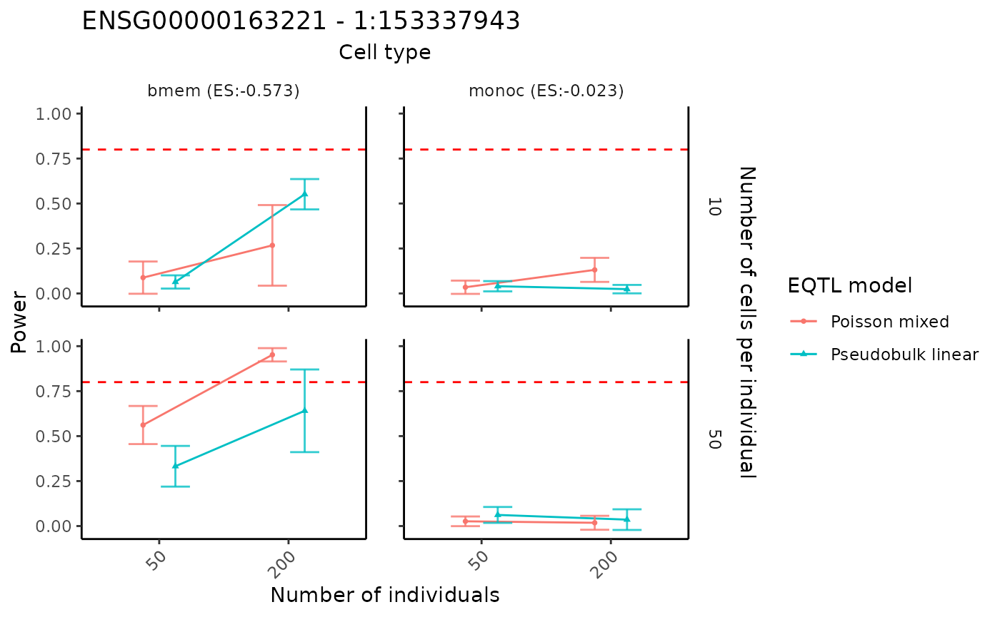
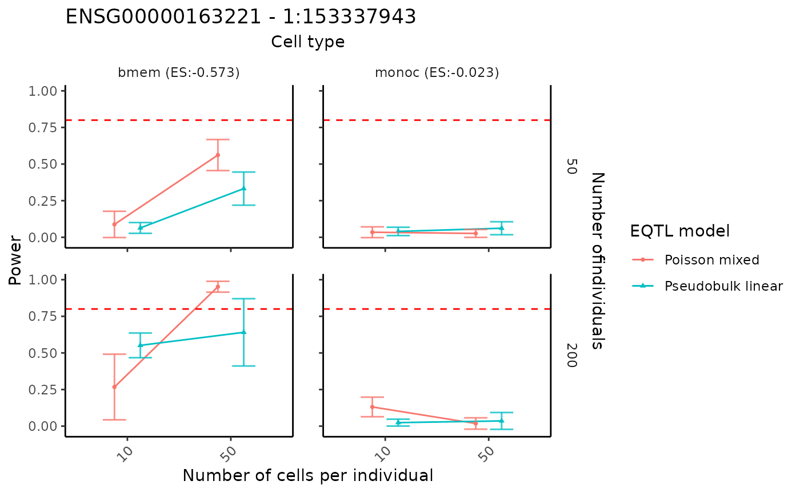

# Power analysis based on a fitted scDesignPop marginal model

## Introduction

scDesignPop provides power analysis tools at cell-type-specific level.
Since fitted marginal models can be obtained by users already for
generating synthetic datasets, the tutorial here is about how to conduct
the power analysis on the basis of the marginal model files.

## Library and data preparation

Here, we load the pre-saved `marginal_list` object to obtain the fitted
marginal model of gene ENSG00000163221 (S100A12) for simplicity.

``` r
library(scDesignPop)
library(SingleCellExperiment)

data("marginal_list_sel")
summary(marginal_list_sel$ENSG00000163221$fit)
#>  Family: nbinom2  ( log )
#> Formula:          
#> response ~ (1 | indiv) + cell_type + `1:153337943` + `1:153337943`:cell_type
#> Data: res_list[["dmat_df"]]
#> 
#>       AIC       BIC    logLik -2*log(L)  df.resid 
#>   11088.7   11158.3   -5534.4   11068.7      7801 
#> 
#> Random effects:
#> 
#> Conditional model:
#>  Groups Name        Variance Std.Dev.
#>  indiv  (Intercept) 0.08141  0.2853  
#> Number of obs: 7811, groups:  indiv, 40
#> 
#> Dispersion parameter for nbinom2 family (): 1.15 
#> 
#> Conditional model:
#>                               Estimate Std. Error z value Pr(>|z|)    
#> (Intercept)                    1.80392    0.07763  23.237   <2e-16 ***
#> cell_typemononc               -4.65391    0.22215 -20.949   <2e-16 ***
#> cell_typebmem                 -5.96487    0.31401 -18.996   <2e-16 ***
#> cell_typecd4nc                -6.44683    0.22816 -28.256   <2e-16 ***
#> `1:153337943`                 -0.02273    0.08603  -0.264    0.792    
#> cell_typemononc:`1:153337943` -0.15160    0.27980  -0.542    0.588    
#> cell_typebmem:`1:153337943`   -0.55004    0.39328  -1.399    0.162    
#> cell_typecd4nc:`1:153337943`  -0.16812    0.29164  -0.576    0.564    
#> ---
#> Signif. codes:  0 '***' 0.001 '**' 0.01 '*' 0.05 '.' 0.1 ' ' 1
```

## Performing power analysis

Given fitted marginal model, scDesignPop can perform simulation-based
power analysis for a specific gene-SNP pair across selected cell types
using the `runPowerAnalysis` function. Based on the previous naming of
covariates, we specify the fitted snpid as `"1:153337943"`, the name of
the column for fixed cell state effect and random individual effect as
`"cell_type"` and `"indiv"` in the input parameters. To check these
namings, we can call the covariate data frame using
`marginal_list_sel[["ENSG00000163221"]]$fit$frame`. The selected cell
types for testing are specified in cellstate_vector and have to be
consistent with the covariate data frame.

Particarly, parameters `snp_number` and `gene_number` are used to
account for multiple testing correction with Bonferroni correction.
Parameter `methods` is used to specify the marginal eQTL model from
`c("nb", "poisson", "gaussian", "pseudoBulkLinear")`. Parameter
`nindivs` and `ncells` are used to specify the number of individuals and
number of cells per individual, from which we can analyze the
performance of power analysis and find the optimal setting.

``` r
set.seed(123)
power_data <- runPowerAnalysis(marginal_list = marginal_list_sel,
                               marginal_model = "nb",
                               geneid = "ENSG00000163221",
                               snpid = "1:153337943",
                               celltype_colname = "cell_type",
                               celltype_vector = c("bmem", "monoc"),
                               indiv_colname = "indiv",
                               methods = c("poisson","pseudoBulkLinear"),
                               nindivs = c(50, 200),
                               ncells = c(10, 50),
                               alpha = 0.05,
                               power_nsim = 1000,
                               snp_number = 10,
                               gene_number = 800,
                               CI_nsim = 1000,
                               CI_conf = 0.05,
                               ncores = 25)
#> [1] -4.160949
#> [1] -0.5727631
#> [1] 1.803924
#> [1] -0.02272728
#> [1] -4.160949
#> [1] -0.5727631
#> [1] 1.803924
#> [1] -0.02272728
```

## Visualization of power results

The power analysis results can be visualized using the
`visualizePowerResult` function. The cell type names in the
`cellstate_vector` must be included in the above power analysis.

``` r
visualizePowerResult(power_result = power_data,
                     celltype_vector = c("bmem", "monoc"),
                     x_axis = "nindiv",
                     y_facet = "ncell",
                     col_group = "method",
                     geneid = "ENSG00000163221",
                     snpid = "1:153337943")
```



By swaping the x and y axis, we can show the result in a different way.

``` r
visualizePowerResult(power_result = power_data,
                     celltype_vector = c("bmem", "monoc"),
                     x_axis = "ncell",
                     y_facet = "nindiv",
                     col_group = "method",
                     geneid = "ENSG00000163221",
                     snpid = "1:153337943")
```


