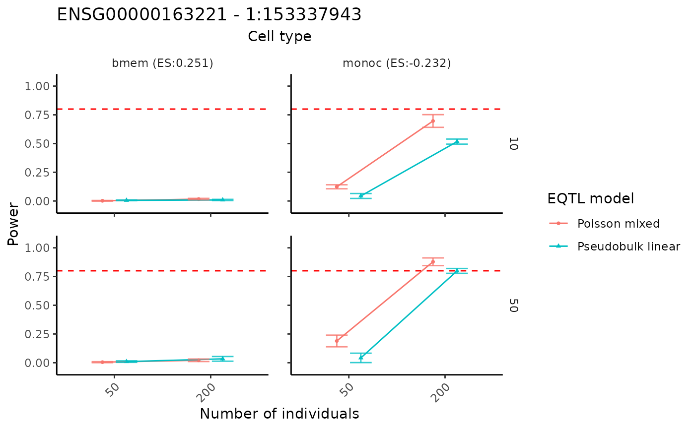
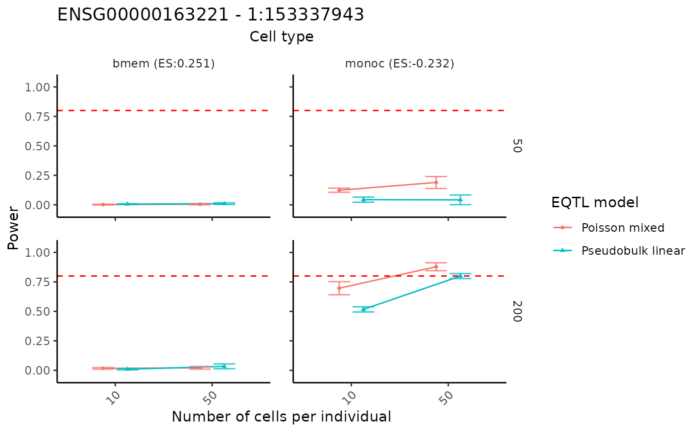
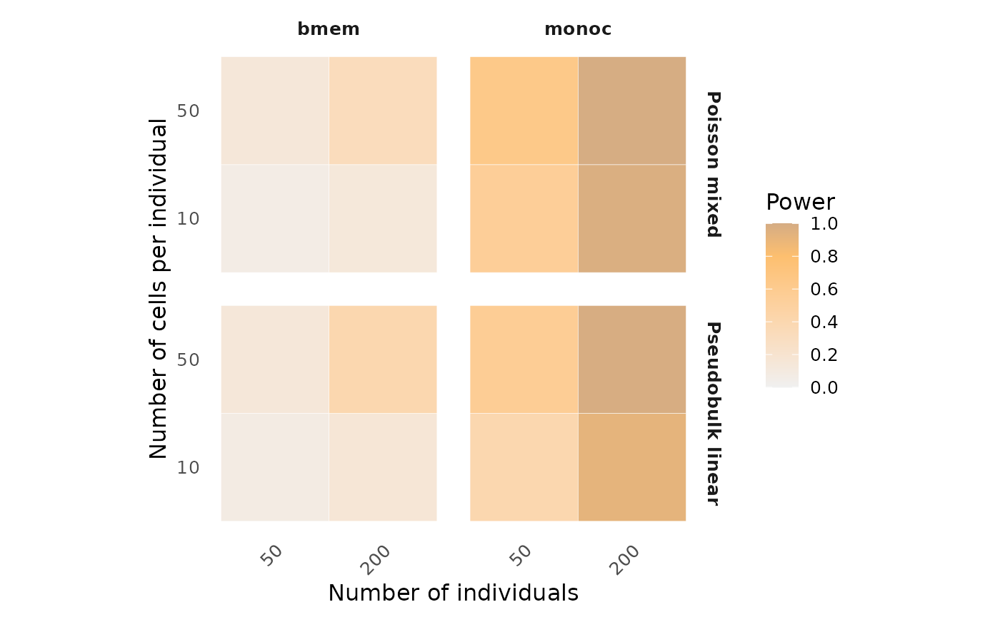

# Power analysis for selected genes

## Introduction

In addition to user-specified effect size scenarios, scDesignPop also
supports data-driven power analysis based on fitted marginal models. In
this setting, effect sizes are inferred from the reference data, and
power is evaluated under the observed settings.

This tutorial demonstrates two usage modes:

- **Fit-then-analyze workflow**: fit marginal models from raw data and
  perform power analysis  
- **Reuse-then-analyze workflow**: directly perform power analysis using
  previously fitted marginal models

Basically, if marginal models are already available (e.g., from
simulation or previous analysis), users can skip the data preparation
and model fitting steps.

------------------------------------------------------------------------

## Library and data preparation

We begin by loading the example dataset and selecting a small subset of
genes for demonstration. This reduces computational cost while
preserving the workflow structure.

``` r
library(scDesignPop)
library(SingleCellExperiment)

data("example_sce")
data("example_eqtlgeno")

example_sce_sel <- example_sce[c("ENSG00000163221","ENSG00000135218"),]

example_eqtlgeno_sel <- example_eqtlgeno[
    which(example_eqtlgeno$gene_id %in% c("ENSG00000163221","ENSG00000135218")),
]
```

We then construct the input data required for modeling, including
expression, covariates, and genotype information.

``` r
data_list_sel <- constructDataPop(
    sce = example_sce_sel,
    eqtlgeno_df = example_eqtlgeno_sel,
    new_covariate = as.data.frame(colData(example_sce_sel)),
    copula_variable = "cell_type",
    slot_name = "counts",
    snp_mode = "single"
)
```

------------------------------------------------------------------------

## Fit marginal models

We next fit marginal models using `fitMarginalPop`. These models
describe the relationship between gene expression, covariates, and
genotype, and provide the basis for simulation-based power analysis.

``` r
marginal_list_sel <- fitMarginalPop(
    data_list = data_list_sel,
    mean_formula = "(1|indiv) + cell_type",
    model_family = "nb",
    interact_colnames = "cell_type",
    parallelization = "parallel",
    n_cores = 20L
)
```

To inspect the fitted model for a specific gene, we can examine the
model summary:

``` r
summary(marginal_list_sel[["ENSG00000163221"]]$fit)
#>  Family: nbinom2  ( log )
#> Formula:          
#> response ~ (1 | indiv) + cell_type + `1:153337943` + `1:153337943`:cell_type
#> Data: res_list[["dmat_df"]]
#> 
#>      AIC      BIC   logLik deviance df.resid 
#>  12422.8  12492.7  -6201.4  12402.8     7988 
#> 
#> Random effects:
#> 
#> Conditional model:
#>  Groups Name        Variance Std.Dev.
#>  indiv  (Intercept) 0.1863   0.4317  
#> Number of obs: 7998, groups:  indiv, 40
#> 
#> Dispersion parameter for nbinom2 family (): 1.06 
#> 
#> Conditional model:
#>                               Estimate Std. Error z value Pr(>|z|)    
#> (Intercept)                    -5.0365     0.3826 -13.165  < 2e-16 ***
#> cell_typecd4nc                  0.5644     0.4171   1.353    0.176    
#> cell_typemonoc                  6.9568     0.3755  18.525  < 2e-16 ***
#> cell_typemononc                 2.4032     0.4121   5.832 5.49e-09 ***
#> `1:153337943`                   0.2514     0.4672   0.538    0.590    
#> cell_typecd4nc:`1:153337943`   -0.9055     0.5733  -1.579    0.114    
#> cell_typemonoc:`1:153337943`   -0.4835     0.4560  -1.060    0.289    
#> cell_typemononc:`1:153337943`  -0.2420     0.5424  -0.446    0.656    
#> ---
#> Signif. codes:  0 '***' 0.001 '**' 0.01 '*' 0.05 '.' 0.1 ' ' 1
```

------------------------------------------------------------------------

## Perform power analysis

We now perform power analysis using `runPowerAnalysis`. In contrast to
the previous tutorial, we do not manually specify effect sizes. Instead,
the function uses the effect sizes estimated in the marginal models,
making this a data-driven evaluation of power.

In this example, we assess power for gene `ENSG00000163221` and SNP
`1:153337943` across two cell types (`bmem` and `monoc`).

The main inputs define:

- **Target features**
  - `geneid`, `snpid`: gene–SNP pair to evaluate  
  - `celltype_vector`: cell types to test
- **Study design**
  - `nindivs`: number of individuals  
  - `ncells`: number of cells per individual
- **eQTL mapping models**
  - `methods`: eQTL mapping models to compare
- **Significance thresholds**
  - `alpha`: unadjusted significance threshold  
  - `snp_number`, `gene_number`: multiple testing correction

Because effect sizes are taken from the fitted models, this analysis
reflects the power of eQTL effects observed in the reference dataset.

``` r
set.seed(123)

power_data <- runPowerAnalysis(
    marginal_list = marginal_list_sel,
    marginal_model = "nb",
    geneid = "ENSG00000163221",
    snpid = "1:153337943",
    celltype_colname = "cell_type",
    celltype_vector = c("bmem", "monoc"),
    indiv_colname = "indiv",
    methods = c("poisson", "pseudoBulkLinear"),
    nindivs = c(50, 200),
    ncells = c(10, 50),
    alpha = 0.05,
    power_nsim = 1000,
    snp_number = 10,
    gene_number = 800,
    CI_nsim = 1000,
    CI_conf = 0.05,
    n_cores = 25
)
#> [1] -5.036509
#> [1] 0.2514451
#> [1] 1.920313
#> [1] -0.2320467
#> [1] -5.036509
#> [1] 0.2514451
#> [1] 1.920313
#> [1] -0.2320467
```

The resulting `power_data` summarizes the estimated power across all
combinations of study design and eQTL mapping models.

------------------------------------------------------------------------

## Visualize power curves

The results can be visualized using `visualizePowerCurve`. This allows
us to examine how power varies as a function of effect size, sample
size, and analysis method.

In the plot below, we visualize power as a function of the specified
effect size, stratified by the number of individuals and cells.

We expect power to increase with larger effect sizes, more individuals,
and more cells per individual.

``` r
visualizePowerCurve(
    power_result = power_data,
    celltype_vector = c("bmem", "monoc"),
    x_axis = "nindiv",
    y_facet = "ncell",
    col_group = "method",
    geneid = "ENSG00000163221",
    snpid = "1:153337943"
)
```



Alternatively, we can swap axes to view the relationship from a
different perspective:

``` r
visualizePowerCurve(
    power_result = power_data,
    celltype_vector = c("bmem", "monoc"),
    x_axis = "ncell",
    y_facet = "nindiv",
    col_group = "method",
    geneid = "ENSG00000163221",
    snpid = "1:153337943"
)
```



------------------------------------------------------------------------

## Visualize power heatmaps

To better summarize optimal study design choices, we can visualize power
across combinations of individuals and cells using a heatmap.

This representation makes it easier to identify regions of high power
and compare performance across cell types and methods.

``` r
visualizePowerHeatmap(
    power_result = power_data,
    nindiv_col   = "nindiv",
    ncell_col    = "ncell",
    x_facet      = "celltype",
    y_facet      = "method",
    power_col    = "power",
    fill_label   = "Power",
    fill_limits  = c(0, 1),
    facet_scales = "fixed",
    base_size    = 12
)
```



## Session information

``` r
sessionInfo()
#> R version 4.2.3 (2023-03-15)
#> Platform: x86_64-pc-linux-gnu (64-bit)
#> Running under: Ubuntu 22.04.5 LTS
#> 
#> Matrix products: default
#> BLAS:   /usr/lib/x86_64-linux-gnu/openblas-pthread/libblas.so.3
#> LAPACK: /usr/lib/x86_64-linux-gnu/openblas-pthread/libopenblasp-r0.3.20.so
#> 
#> locale:
#>  [1] LC_CTYPE=en_US.UTF-8       LC_NUMERIC=C              
#>  [3] LC_TIME=en_US.UTF-8        LC_COLLATE=en_US.UTF-8    
#>  [5] LC_MONETARY=en_US.UTF-8    LC_MESSAGES=en_US.UTF-8   
#>  [7] LC_PAPER=en_US.UTF-8       LC_NAME=C                 
#>  [9] LC_ADDRESS=C               LC_TELEPHONE=C            
#> [11] LC_MEASUREMENT=en_US.UTF-8 LC_IDENTIFICATION=C       
#> 
#> attached base packages:
#> [1] stats4    stats     graphics  grDevices utils     datasets  methods  
#> [8] base     
#> 
#> other attached packages:
#>  [1] SingleCellExperiment_1.20.1 SummarizedExperiment_1.28.0
#>  [3] Biobase_2.58.0              GenomicRanges_1.50.2       
#>  [5] GenomeInfoDb_1.34.9         IRanges_2.32.0             
#>  [7] S4Vectors_0.36.2            BiocGenerics_0.44.0        
#>  [9] MatrixGenerics_1.10.0       matrixStats_1.1.0          
#> [11] scDesignPop_0.0.0.9012      BiocStyle_2.26.0           
#> 
#> loaded via a namespace (and not attached):
#>  [1] sass_0.4.10            jsonlite_2.0.0         splines_4.2.3         
#>  [4] bslib_0.9.0            assertthat_0.2.1       BiocManager_1.30.25   
#>  [7] GenomeInfoDbData_1.2.9 yaml_2.3.10            numDeriv_2016.8-1.1   
#> [10] pillar_1.10.2          lattice_0.22-6         glue_1.8.0            
#> [13] digest_0.6.37          RColorBrewer_1.1-3     XVector_0.38.0        
#> [16] glmmTMB_1.1.9          minqa_1.2.8            htmltools_0.5.8.1     
#> [19] Matrix_1.6-5           pkgconfig_2.0.3        bookdown_0.43         
#> [22] zlibbioc_1.44.0        scales_1.4.0           lme4_1.1-35.3         
#> [25] tibble_3.2.1           mgcv_1.9-1             generics_0.1.4        
#> [28] farver_2.1.2           ggplot2_3.5.2          cachem_1.1.0          
#> [31] withr_3.0.2            pbapply_1.7-2          TMB_1.9.11            
#> [34] cli_3.6.5              magrittr_2.0.3         evaluate_1.0.3        
#> [37] fs_1.6.6               nlme_3.1-164           MASS_7.3-58.2         
#> [40] textshaping_0.4.0      tools_4.2.3            lifecycle_1.0.4       
#> [43] stringr_1.5.1          DelayedArray_0.24.0    irlba_2.3.5.1         
#> [46] compiler_4.2.3         pkgdown_2.2.0          jquerylib_0.1.4       
#> [49] systemfonts_1.2.3      rlang_1.1.6            grid_4.2.3            
#> [52] RCurl_1.98-1.17        nloptr_2.2.1           rstudioapi_0.17.1     
#> [55] htmlwidgets_1.6.4      labeling_0.4.3         bitops_1.0-9          
#> [58] rmarkdown_2.27         boot_1.3-30            gtable_0.3.6          
#> [61] R6_2.6.1               knitr_1.50             dplyr_1.1.4           
#> [64] fastmap_1.2.0          uwot_0.2.3             ragg_1.5.0            
#> [67] desc_1.4.3             stringi_1.8.7          parallel_4.2.3        
#> [70] Rcpp_1.0.14            vctrs_0.6.5            tidyselect_1.2.1      
#> [73] xfun_0.52
```
