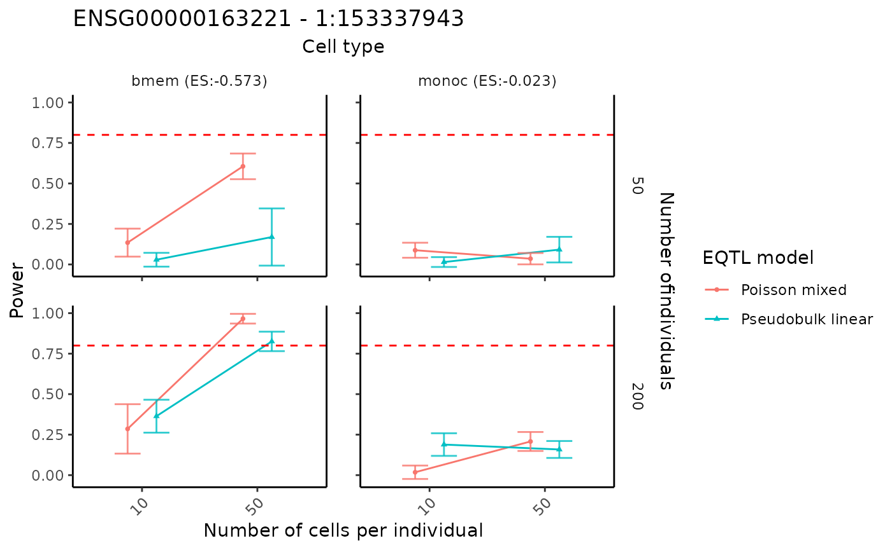

# Power analysis for selected genes

## Introduction

scDesignPop provides power analysis tools at cell-type-specific level.
The tutorial here provides two options to perform power analyis using
scDesignPop: 1) first fit the marginal models for selected genes and
then conduct power analysis or 2) conduct the power analysis directly on
the previous marginal models if users have already done synthetic
dataset generation. For the second option, users can skip the Library
and data preparation and Fitting the marginal model sections.

## Library and data preparation

Given raw count data, scDesignPop can perform simulation-based power
analysis for a specific gene-SNP pair across cell types from the
expression count data. A list of data is required as input. This is done
using the `constructDataPop` function. A `SingleCellExperiment` object
and an `eqtlgeno` dataframe are the two main inputs needed. The
`eqtlgeno` dataframe consists of eQTL annotations (it must have cell
state, gene, SNP, chromosome, and position columns at a minimum), and
genotypes across individuals (columns) for every SNP (rows). The
structure of an example `eqtlgeno` dataframe is given below.

``` r
library(scDesignPop)
library(SingleCellExperiment)

data("example_sce")
data("example_eqtlgeno")
example_sce_sel <- example_sce[c("ENSG00000163221","ENSG00000135218"),]
example_eqtlgeno_sel <- example_eqtlgeno[
    which(example_eqtlgeno$gene_id%in%c("ENSG00000163221","ENSG00000135218")),]
```

``` r
data_list_sel <- constructDataPop(
    sce = example_sce_sel,
    eqtlgeno_df = example_eqtlgeno_sel,
    new_covariate = as.data.frame(colData(example_sce_sel)),
    overlap_features = NULL,
    sampid_vec = NULL,
    copula_variable = "cell_type",
    slot_name = "counts",
    snp_mode = "single",
    celltype_colname = "cell_type",
    feature_colname = "gene_id",
    snp_colname = "snp_id",
    loc_colname = "POS",
    chrom_colname = "CHR",
    indiv_colname = "indiv",
    prune_thres = 0.9
    )
```

## Fitting the marginal model

Next, a marginal model is specified to fit each gene using the
`fitMarginalPop` function.  
Here we use a Negative Binominal as the parametric model using `"nb"`.

``` r
marginal_list_sel <- fitMarginalPop(
    data_list = data_list_sel,
    mean_formula = "(1|indiv) + cell_type",
    model_family = "nb",
    interact_colnames = "cell_type",
    parallelization = "pbmcapply",
    n_threads = 1L,
    loc_colname = "POS",
    snp_colname = "snp_id",
    celltype_colname = "cell_type",
    indiv_colname = "indiv",
    filter_snps = TRUE,
    snpvar_thres = 0,
    force_formula = FALSE,
    data_maxsize = 1
    )
```

## Performing power analysis

Given fitted marginal model, scDesignPop can perform simulation-based
power analysis for a specific gene-SNP pair across selected cell types
using the `runPowerAnalysis` function. Based on the previous naming of
covariates, we specify the fitted snpid as `"1:153337943"`, the name of
the column for fixed cell state effect and random individual effect as
`"cell_type"` and `"indiv"` in the input parameters. To check these
namings, we can call the covariate data frame using
`marginal_list_sel[["ENSG00000163221"]]$fit$frame`. The selected cell
types for testing are specified in cellstate_vector and have to be
consistent with the covariate data frame.

Particarly, parameters `snp_number` and `gene_number` are used to
account for multiple testing correction with Bonferroni correction.
Parameter `methods` is used to specify the marginal eQTL model from
`c("nb", "poisson", "gaussian", "pseudoBulkLinear")`. Parameter
`nindivs` and `ncells` are used to specify the number of individuals and
number of cells per individual, from which we can analyze the
performance of power analysis and find the optimal setting. Here, we set
`power_nsim = 1000` to increase the number of simulations so we can
calculate power with a higher resolution. Using `power_nsim = 100` in
default or smaller values can reduce the computation time cost.

``` r
summary(marginal_list_sel[["ENSG00000163221"]]$fit)
#>  Family: nbinom2  ( log )
#> Formula:          
#> response ~ (1 | indiv) + cell_type + `1:153337943` + `1:153337943`:cell_type
#> Data: res_list[["dmat_df"]]
#> 
#>      AIC      BIC   logLik deviance df.resid 
#>  11088.7  11158.3  -5534.4  11068.7     7801 
#> 
#> Random effects:
#> 
#> Conditional model:
#>  Groups Name        Variance Std.Dev.
#>  indiv  (Intercept) 0.08141  0.2853  
#> Number of obs: 7811, groups:  indiv, 40
#> 
#> Dispersion parameter for nbinom2 family (): 1.15 
#> 
#> Conditional model:
#>                               Estimate Std. Error z value Pr(>|z|)    
#> (Intercept)                    1.80392    0.07763  23.237   <2e-16 ***
#> cell_typemononc               -4.65391    0.22215 -20.949   <2e-16 ***
#> cell_typebmem                 -5.96487    0.31401 -18.996   <2e-16 ***
#> cell_typecd4nc                -6.44683    0.22816 -28.256   <2e-16 ***
#> `1:153337943`                 -0.02273    0.08603  -0.264    0.792    
#> cell_typemononc:`1:153337943` -0.15160    0.27980  -0.542    0.588    
#> cell_typebmem:`1:153337943`   -0.55004    0.39328  -1.399    0.162    
#> cell_typecd4nc:`1:153337943`  -0.16812    0.29164  -0.576    0.564    
#> ---
#> Signif. codes:  0 '***' 0.001 '**' 0.01 '*' 0.05 '.' 0.1 ' ' 1
```

``` r
set.seed(123)
power_data <- runPowerAnalysis(marginal_list = marginal_list_sel,
                               marginal_model = "nb",
                               geneid = "ENSG00000163221",
                               snpid = "1:153337943",
                               celltype_colname = "cell_type",
                               celltype_vector = c("bmem", "monoc"),
                               indiv_colname = "indiv",
                               methods = c("poisson","pseudoBulkLinear"),
                               nindivs = c(50, 200),
                               ncells = c(10, 50),
                               alpha = 0.05,
                               power_nsim = 1000,
                               snp_number = 10,
                               gene_number = 800,
                               CI_nsim = 1000,
                               CI_conf = 0.05,
                               ncores = 25)
#> [1] -4.160949
#> [1] -0.5727631
#> [1] 1.803924
#> [1] -0.02272728
#> [1] -4.160949
#> [1] -0.5727631
#> [1] 1.803924
#> [1] -0.02272728
```

## Visualization of power results

The power analysis results can be visualized using the
`visualizePowerCurve` function. The cell type names in the
`cellstate_vector` in the input parameters above must be included in the
above power analysis.

``` r
visualizePowerCurve(power_result = power_data,
                    celltype_vector = c("bmem", "monoc"),
                    x_axis = "nindiv",
                    y_facet = "ncell",
                    col_group = "method",
                    geneid = "ENSG00000163221",
                    snpid = "1:153337943")
```



By swaping the x and y axis, we can show the result in a different way.

``` r
visualizePowerCurve(power_result = power_data,
                    celltype_vector = c("bmem", "monoc"),
                    x_axis = "ncell",
                    y_facet = "nindiv",
                    col_group = "method",
                    geneid = "ENSG00000163221",
                    snpid = "1:153337943")
```


To better visualize the optimal study design, alternatively, power
results can be shown in heatmaps across different study designs using
the `visualizePowerHeatmap` function.

``` r
visualizePowerHeatmap(power_result = power_data,
                      nindiv_col   = "nindiv",
                      ncell_col    = "ncell",
                      x_facet      = "celltype",
                      y_facet      = "method",
                      power_col    = "power",
                      fill_label   = "Power",
                      fill_limits  = c(0, 1),
                      facet_scales = "fixed",
                      base_size    = 12)
```


