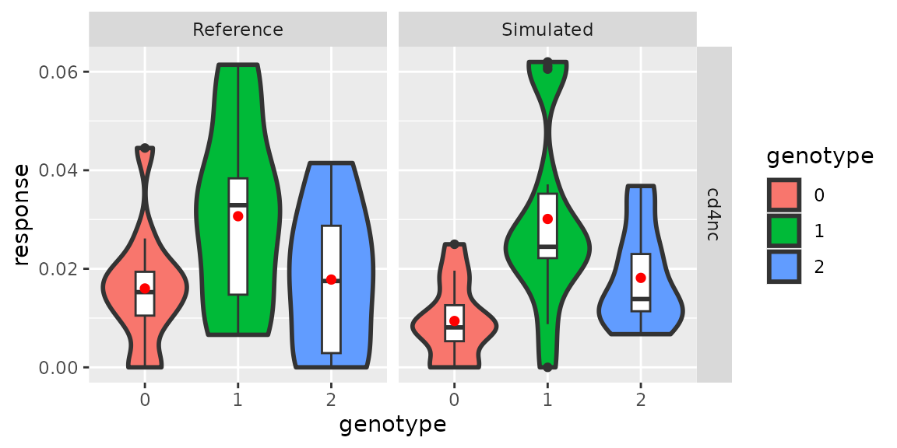

# Modeling trans-eQTL effect using public data

## Introduction

scDesignPop supports user-defined eQTL pairs, making it straightforward
to extend the framework to trans-eQTL studies with known ground truth.

## Library and data preparation

Here, we use an example trans-eQTL genotype dataframe
`example_eqtlgeno_trans` to demonstrate how scDesignPop can also model
trans-eQTL effects. Based on the trans-eQTL list from eQTLGen phase 1
(<https://www.eqtlgen.org/trans-eqtls.html>), we constructed a example
genotype dataframe with permuted genotypes to show how trans-eQTL
effects can be preserved in scDesignPop simulation. The download link of
the full trans-eQTL list is
<https://download.gcc.rug.nl/downloads/eqtlgen/trans-eqtl/2018-09-04-trans-eQTLsFDR0.05-CohortInfoRemoved-BonferroniAdded.txt.gz>.

``` r
library(scDesignPop)
library(SingleCellExperiment)
library(SummarizedExperiment)
library(ggplot2)
library(data.table)

data("example_sce")
data("example_eqtlgeno_trans")

example_sce
#> class: SingleCellExperiment 
#> dim: 982 7998 
#> metadata(0):
#> assays(1): counts
#> rownames(982): ENSG00000023902 ENSG00000028137 ... ENSG00000254709
#>   ENSG00000273272
#> rowData names(0):
#> colnames(7998): Cell1 Cell2 ... Cell7997 Cell7998
#> colData names(5): indiv pool cell_type sex age
#> reducedDimNames(0):
#> mainExpName: NULL
#> altExpNames(0):
head(example_eqtlgeno_trans[,1:8])
#> # A tibble: 6 × 8
#>   cell_type gene_id         snp_id        CHR       POS SAMP1 SAMP2 SAMP3
#>   <chr>     <chr>           <chr>       <int>     <int> <dbl> <dbl> <dbl>
#> 1 bulk      ENSG00000159674 10:94450233    10  94450233     2     2     1
#> 2 bulk      ENSG00000110077 2:182323766     2 182323766     2     1     1
#> 3 bulk      ENSG00000117281 10:94450233    10  94450233     2     2     1
#> 4 bulk      ENSG00000149557 10:94450233    10  94450233     2     2     1
#> 5 bulk      ENSG00000006075 10:94450233    10  94450233     2     2     1
#> 6 bulk      ENSG00000163453 10:94450233    10  94450233     2     2     1
```

## Modeling and simulation

### Step 1: construct a data list

To run scDesignPop, a list of data is required as input. This is done
using the `constructDataPop` function. A `SingleCellExperiment` object
and an `eqtlgeno` dataframe are the two main inputs needed. The
`eqtlgeno` dataframe consists of eQTL annotations (it must have cell
state, gene, SNP, chromosome, and position columns at a minimum), and
genotypes across individuals (columns) for every SNP (rows). Here, we
use `example_sce` to filter for overlapped genes in
`example_eqtlgeno_trans` object created

``` r
overlap_genes <- intersect(rownames(example_sce), example_eqtlgeno_trans$gene_id)
example_eqtlgeno_trans <- example_eqtlgeno_trans[which(example_eqtlgeno_trans$gene_id %in% overlap_genes), ]
example_sce <- example_sce[which(rownames(example_sce) %in% overlap_genes), ]
```

``` r
data_list <- constructDataPop(
    sce = example_sce,
    eqtlgeno_df = example_eqtlgeno_trans,
    new_covariate = as.data.frame(colData(example_sce)),
    copula_variable = "cell_type",
    slot_name = "counts",
    snp_mode = "single"
    )
```

### Step 2: fit marginal model

Next, a marginal model is specified to fit each gene using the
`fitMarginalPop` function.  
Here we use a Negative Binominal as the parametric model using `"nb"`.

``` r
marginal_list <- fitMarginalPop(
    data_list = data_list,
    mean_formula = "(1|indiv) + cell_type",
    model_family = "nb",
    interact_colnames = "cell_type",
    parallelization = "parallel",
    n_threads = 20L
    )
```

### Step 3: fit a Gaussian copula

The third step is to fit a Gaussian copula using the `fitCopulaPop`
function.

``` r
set.seed(123, kind = "L'Ecuyer-CMRG")

copula_fit <- fitCopulaPop(
    sce = example_sce,
    assay_use = "counts",
    input_data = data_list[["covariate"]],
    marginal_list = marginal_list,
    family_use = "nb",
    copula = "gaussian",
    n_cores = 2L,
    parallelization = "parallel"
    )

RNGkind("Mersenne-Twister")  # reset
```

### Step 4: extract parameters

The fourth step is to compute the mean, sigma, and zero probability
parameters using the `extractParaPop` function.

``` r
para_new <- extractParaPop(
    sce = example_sce,
    assay_use = "counts",
    marginal_list = marginal_list,
    n_cores = 2L,
    family_use = "nb",
    new_covariate = data_list[["new_covariate"]],
    new_eqtl_geno_list = data_list[["eqtl_geno_list"]],
    data = data_list[["covariate"]],
    parallelization = "parallel"
    )
```

### Step 5: simulate counts

The fifth step is to simulate counts using the `simuNewPop` function.

``` r
set.seed(123, kind = "L'Ecuyer-CMRG")

newcount_mat <- simuNewPop(
    sce = example_sce,
    mean_mat = para_new[["mean_mat"]],
    sigma_mat = para_new[["sigma_mat"]],
    zero_mat = para_new[["zero_mat"]],
    copula_list = copula_fit[["copula_list"]],
    n_cores = 2L,
    family_use = "nb",
    input_data = data_list[["covariate"]],
    new_covariate = data_list[["new_covariate"]],
    important_feature = copula_fit[["important_feature"]],
    filtered_gene = data_list[["filtered_gene"]],
    parallelization = "parallel"
    )

RNGkind("Mersenne-Twister")  # reset
```

### Step 6: create SingleCellExperiment object using simulated data

After simulating the data, we can create a `SingleCellExperiment` object
as follows.

``` r
simu_sce <- SingleCellExperiment(list(counts = newcount_mat), 
                                 colData = data_list[["new_covariate"]])
names(assays(simu_sce)) <- "counts"

rowData(simu_sce) <- rowData(example_sce)

simu_sce
#> class: SingleCellExperiment 
#> dim: 27 7998 
#> metadata(0):
#> assays(1): counts
#> rownames(27): ENSG00000117281 ENSG00000198574 ... ENSG00000100219
#>   ENSG00000225783
#> rowData names(0):
#> colnames(7998): Cell1 Cell2 ... Cell7997 Cell7998
#> colData names(6): indiv pool ... age corr_group
#> reducedDimNames(0):
#> mainExpName: NULL
#> altExpNames(0):
```

## Create and visualize pseudobulk expression data

Next, we create pseudobulk data by normalizing the SCE object in the
data using `log1p` and then aggregate using `mean`. We specify the gene
at the trans-eQTL loci as well using the `createPbulkExprGeno` function.
Finally, we visualize the pseudobulk expression for the gene at this
loci.

``` r
res_list <- createPbulkExprGeno(sce_list = list("Reference" = example_sce,
                                                "Simulated" = simu_sce),
                                eqtlgeno = example_eqtlgeno_trans,
                                feature_sel = "ENSG00000006075",
                                celltype_sel = "cd4nc",
                                eqtl_snp = "10:94450233",
                                normalize_type = "log1p",
                                aggregate_type = "mean",
                                slot_name = "logcounts",
                                overwrite = TRUE,
                                if_plot = TRUE)
res_list[["p_pbulk"]]
```



## Session information

``` r
sessionInfo()
#> R version 4.2.3 (2023-03-15)
#> Platform: x86_64-pc-linux-gnu (64-bit)
#> Running under: Ubuntu 22.04.5 LTS
#> 
#> Matrix products: default
#> BLAS:   /usr/lib/x86_64-linux-gnu/openblas-pthread/libblas.so.3
#> LAPACK: /usr/lib/x86_64-linux-gnu/openblas-pthread/libopenblasp-r0.3.20.so
#> 
#> locale:
#>  [1] LC_CTYPE=en_US.UTF-8       LC_NUMERIC=C              
#>  [3] LC_TIME=en_US.UTF-8        LC_COLLATE=en_US.UTF-8    
#>  [5] LC_MONETARY=en_US.UTF-8    LC_MESSAGES=en_US.UTF-8   
#>  [7] LC_PAPER=en_US.UTF-8       LC_NAME=C                 
#>  [9] LC_ADDRESS=C               LC_TELEPHONE=C            
#> [11] LC_MEASUREMENT=en_US.UTF-8 LC_IDENTIFICATION=C       
#> 
#> attached base packages:
#> [1] stats4    stats     graphics  grDevices utils     datasets  methods  
#> [8] base     
#> 
#> other attached packages:
#>  [1] data.table_1.17.4           ggplot2_3.5.2              
#>  [3] SingleCellExperiment_1.20.1 SummarizedExperiment_1.28.0
#>  [5] Biobase_2.58.0              GenomicRanges_1.50.2       
#>  [7] GenomeInfoDb_1.34.9         IRanges_2.32.0             
#>  [9] S4Vectors_0.36.2            BiocGenerics_0.44.0        
#> [11] MatrixGenerics_1.10.0       matrixStats_1.1.0          
#> [13] scDesignPop_0.0.0.9012      BiocStyle_2.26.0           
#> 
#> loaded via a namespace (and not attached):
#>  [1] tidyr_1.3.1            sass_0.4.10            jsonlite_2.0.0        
#>  [4] splines_4.2.3          bslib_0.9.0            assertthat_0.2.1      
#>  [7] BiocManager_1.30.25    GenomeInfoDbData_1.2.9 yaml_2.3.10           
#> [10] numDeriv_2016.8-1.1    pillar_1.10.2          lattice_0.22-6        
#> [13] glue_1.8.0             digest_0.6.37          RColorBrewer_1.1-3    
#> [16] XVector_0.38.0         glmmTMB_1.1.9          minqa_1.2.8           
#> [19] htmltools_0.5.8.1      Matrix_1.6-5           pkgconfig_2.0.3       
#> [22] bookdown_0.43          zlibbioc_1.44.0        purrr_1.0.4           
#> [25] mvtnorm_1.3-3          scales_1.4.0           lme4_1.1-35.3         
#> [28] tibble_3.2.1           mgcv_1.9-1             generics_0.1.4        
#> [31] farver_2.1.2           cachem_1.1.0           withr_3.0.2           
#> [34] pbapply_1.7-2          TMB_1.9.11             cli_3.6.5             
#> [37] magrittr_2.0.3         evaluate_1.0.3         fs_1.6.6              
#> [40] nlme_3.1-164           MASS_7.3-58.2          textshaping_0.4.0     
#> [43] tools_4.2.3            lifecycle_1.0.4        DelayedArray_0.24.0   
#> [46] irlba_2.3.5.1          compiler_4.2.3         pkgdown_2.2.0         
#> [49] jquerylib_0.1.4        systemfonts_1.2.3      rlang_1.1.6           
#> [52] grid_4.2.3             RCurl_1.98-1.17        nloptr_2.2.1          
#> [55] rstudioapi_0.17.1      htmlwidgets_1.6.4      labeling_0.4.3        
#> [58] bitops_1.0-9           rmarkdown_2.27         boot_1.3-30           
#> [61] gtable_0.3.6           R6_2.6.1               knitr_1.50            
#> [64] dplyr_1.1.4            fastmap_1.2.0          uwot_0.2.3            
#> [67] utf8_1.2.5             ragg_1.5.0             desc_1.4.3            
#> [70] parallel_4.2.3         Rcpp_1.0.14            vctrs_0.6.5           
#> [73] tidyselect_1.2.1       xfun_0.52
```
