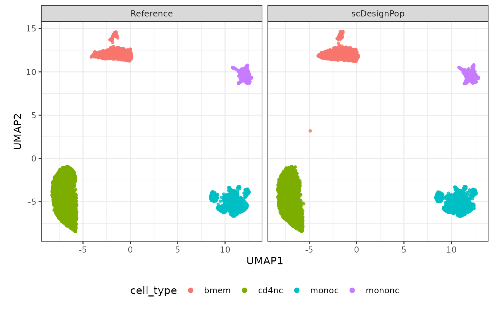
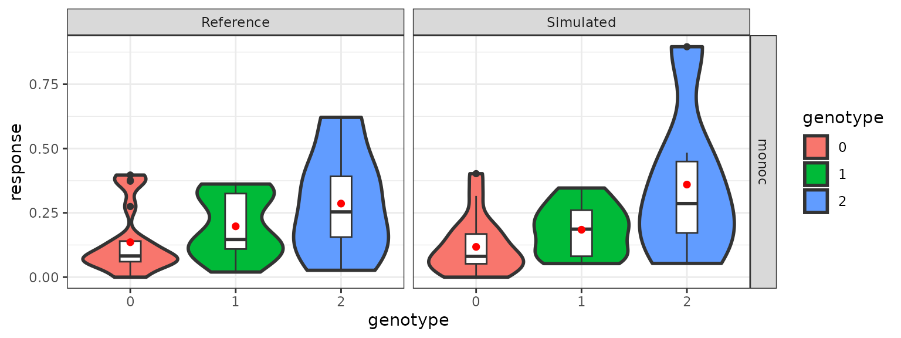

# scDesignPop Quickstart

## Introduction

Population-scale single-cell RNA-sequencing (scRNA-seq) provides an
unprecedented opportunity to study how genetic variation shapes gene
expression at cellular resolution. However, generating such datasets
remains costly, methodological choices for eQTL analysis still lacks
concensus, and sharing individual-level data raises privacy concerns.

scDesignPop is a generative framework designed to address these
challenges by simulating realistic population-scale single-cell datasets
with genetic effects. By learning from a reference dataset, it enables
users to generate synthetic data that preserves key biological and
statistical properties, while providing flexibility for study design,
benchmarking, and privacy-aware data sharing.

## Overview of the workflow

In this tutorial, we demonstrate a minimal workflow for using
scDesignPop. Starting from a reference dataset consisting of gene
expression and genotype information, we construct model inputs, fit
gene-level marginal and joint models, and finally generate simulated
datasets.

## Load packages and example data

We begin by loading the required packages and example datasets provided
in scDesignPop.

``` r
library(scDesignPop)
library(SingleCellExperiment)
library(SummarizedExperiment)
library(ggplot2)
theme_set(theme_bw())

data("example_sce")
data("example_eqtlgeno")
```

## Inspect the data

We first examine the structure of the input datasets. The `example_sce`
object contains gene expression across cells along with cell-level
metadata such as cell type and individual identity.

``` r
dim(example_sce)
#> [1]  982 7998
head(colData(example_sce))
#> DataFrame with 6 rows and 5 columns
#>          indiv     pool cell_type      sex       age
#>       <factor> <factor>  <factor> <factor> <numeric>
#> Cell1   SAMP30        1    bmem          2        76
#> Cell2   SAMP30        1    monoc         2        76
#> Cell3   SAMP30        1    mononc        2        76
#> Cell4   SAMP30        1    monoc         2        76
#> Cell5   SAMP30        1    monoc         2        76
#> Cell6   SAMP30        1    bmem          2        76
```

The `example_eqtlgeno` dataframe contains genotype information and
candidate gene–SNP pairs that define putative eQTL relationships.

``` r
head(example_eqtlgeno)
#> # A tibble: 6 × 45
#>   cell_type gene_id      snp_id   CHR    POS SAMP1 SAMP2 SAMP3 SAMP4 SAMP5 SAMP6
#>   <chr>     <chr>        <chr>  <dbl>  <dbl> <dbl> <dbl> <dbl> <dbl> <dbl> <dbl>
#> 1 monoc     ENSG0000016… 1:101…     1 1.02e7     0     0     0     0     0     0
#> 2 monoc     ENSG0000022… 1:108…     1 1.09e8     1     0     0     0     1     0
#> 3 cd4et     ENSG0000016… 1:110…     1 1.11e7     2     2     2     2     2     2
#> 4 cd8et     ENSG0000006… 1:111…     1 1.12e8     2     2     2     2     2     2
#> 5 nk        ENSG0000006… 1:111…     1 1.12e8     2     2     2     2     2     2
#> 6 nkr       ENSG0000006… 1:111…     1 1.12e8     2     2     2     2     2     2
#> # ℹ 34 more variables: SAMP7 <dbl>, SAMP8 <dbl>, SAMP9 <dbl>, SAMP10 <dbl>,
#> #   SAMP11 <dbl>, SAMP12 <dbl>, SAMP13 <dbl>, SAMP14 <dbl>, SAMP15 <dbl>,
#> #   SAMP16 <dbl>, SAMP17 <dbl>, SAMP18 <dbl>, SAMP19 <dbl>, SAMP20 <dbl>,
#> #   SAMP21 <dbl>, SAMP22 <dbl>, SAMP23 <dbl>, SAMP24 <dbl>, SAMP25 <dbl>,
#> #   SAMP26 <dbl>, SAMP27 <dbl>, SAMP28 <dbl>, SAMP29 <dbl>, SAMP30 <dbl>,
#> #   SAMP31 <dbl>, SAMP32 <dbl>, SAMP33 <dbl>, SAMP34 <dbl>, SAMP35 <dbl>,
#> #   SAMP36 <dbl>, SAMP37 <dbl>, SAMP38 <dbl>, SAMP39 <dbl>, SAMP40 <dbl>
```

This example includes $982$ genes, $7,998$ cells, $40$ individuals, and
$2,792$ putative eQTLs, and is used for demonstration purposes.

## Modeling and simulation

### Step 1: construct a data list

We begin by preparing the reference data for downstream modeling and
simulation using `constructDataPop`. This function extracts the
expression matrix and cell-level covariates from the
`SingleCellExperiment` object, processes the eQTL/genotype dataframe
into gene-specific genotype inputs, and filters features and SNPs as
needed. The resulting objects provide a standardized interface for the
remaining steps of the scDesignPop workflow.

The two main inputs are a `SingleCellExperiment` object (`sce`) and an
eQTL/genotype dataframe (`eqtlgeno_df`). The `SingleCellExperiment`
object stores the expression matrix together with cell-level metadata,
whereas the eQTL/genotype dataframe contains eQTL annotations and SNP
genotypes across individuals. At minimum, the eQTL/genotype dataframe
should include columns specifying the gene, SNP, chromosome, genomic
position, and cell state or cell type, followed by genotype columns for
each individual.

In this example, we use the raw count matrix stored in the `"counts"`
assay of `example_sce`, and we provide
`new_covariate = as.data.frame(colData(example_sce))` so that the
simulation is performed using the same cell-level covariate structure as
the reference data. We also set `copula_variable = "cell_type"`, which
means that the copula model will later be fitted separately within each
cell type.

Several arguments are used to tell `constructDataPop` how variables are
named in the input data:

- `slot_name = "counts"` specifies which assay in the
  `SingleCellExperiment` object should be used as the expression matrix.
  In most cases, this will be `"counts"` for UMI count data.
- `celltype_colname = "cell_type"` specifies the column in both
  `eqtlgeno_df` and the cell metadata of `sce` that contains cell type
  labels.
- `feature_colname = "gene_id"` specifies the gene identifier column in
  `eqtlgeno_df`.
- `snp_colname = "snp_id"` specifies the SNP identifier column in
  `eqtlgeno_df`.
- `chrom_colname = "CHR"` and `loc_colname = "POS"` specify the
  chromosome and genomic position columns for SNP annotation.
- `indiv_colname = "indiv"` specifies the individual identifier column
  in the cell metadata of `sce`.

These column-name arguments should be changed to match the user’s own
data. For example, if the gene column in the eQTL dataframe is called
`gene`, then `feature_colname = "gene"` should be used instead.

The arguments `snp_mode` and `copula_variable` determine two important
modeling choices:

- `snp_mode = "single"` indicates that each gene is modeled using a
  single SNP. This is appropriate when the eQTL input already defines
  one SNP per gene, or when a single lead SNP is used for each gene.

- `snp_mode = "multi"` allows multiple SNPs per gene. In this case, SNPs
  are pruned based on genotype correlation, with `prune_thres`
  controlling the correlation threshold used for pruning.

- `copula_variable = "cell_type"` means that the copula model will be
  fitted separately for each cell type. If `copula_variable = NULL`,
  then one copula is fitted across all cells. If continuous cell-state
  information such as pseudotime is available, users can instead set
  `copula_variable = time_colname`, where `time_column` specifies the
  column in both `eqtlgeno_df` and the cell metadata of `sce` that
  contains continuous cell state/pseudotime values, in which case cells
  are grouped into time quantiles for copula fitting.

The resulting `data_list` contains the core inputs used throughout the
pipeline, including the expression matrix, cell covariates, filtered
feature sets, and gene-specific genotype tables used for model fitting
and simulation.

Below, we use the example data and explicitly map each required variable
to its column name.

``` r
data_list <- constructDataPop(
    sce = example_sce,
    eqtlgeno_df = example_eqtlgeno,
    new_covariate = as.data.frame(colData(example_sce)),
    copula_variable = "cell_type",
    slot_name = "counts",
    snp_mode = "single",
    celltype_colname = "cell_type",
    feature_colname = "gene_id",
    snp_colname = "snp_id",
    loc_colname = "POS",
    chrom_colname = "CHR",
    indiv_colname = "indiv"
)
```

### Step 2: Fit marginal models

We next fit a marginal model for each gene using `fitMarginalPop`. In
scDesignPop, the marginal model describes the distribution of expression
for one gene at a time as a function of cell-level covariates,
individual-level covariates, and genetic effects. These fitted
gene-level models form the foundation of the generative framework,
because they determine the mean structure that will later be used for
simulation.

A key argument in this step is `mean_formula`, which specifies the
baseline model for gene expression **without explicitly including SNP
terms**. Users should provide the covariates and random effects that
they want to include in the gene expression model, and scDesignPop then
automatically adds the SNP genotype effect, together with any requested
first-order SNP interaction terms. This design allows genotype effects
from different SNPs to be incorporated consistently across genes
automatically.

In the example below, we use

``` r
mean_formula = "(1|indiv) + cell_type"
```

which includes: - a random intercept for `indiv`, to account for
correlation among cells from the same individual - a fixed effect for
`cell_type`, to capture differences in baseline expression across cell
types

We also set

``` r
interact_colnames = "cell_type"
```

so that SNP effects are allowed to vary across cell types through
first-order SNP-by-cell-type interactions. This is useful when the goal
is to model cell-type-specific genetic effects.

Several arguments control the main modeling choices:

- `model_family = "nb"` specifies the parametric family used for model
  fitting. For count-based scRNA-seq data, the negative binomial family
  is often a natural choice because it accommodates overdispersion
  relative to a Poisson model.
- `mean_formula` specifies the non-genetic part of the mean model,
  including fixed effects and random effects. Users should include
  covariates they want to adjust for here, such as cell type, batch,
  sex, age, or other biological and technical factors.
- `interact_colnames` specifies which covariates should have first-order
  interactions with SNP genotype. For example, setting
  `interact_colnames = "cell_type"` allows genetic effects to differ
  across cell types. If no interaction is needed, this can be left as
  `NULL`.
- `parallelization` and `n_cores` control how gene-wise model fitting is
  parallelized. Since one model is fit per gene, this step can be
  computationally expensive for large datasets, which makes the
  parallelization necessary.

In practice, users should tailor `mean_formula` to the structure of
their study. For example: - if the data include repeated cells from each
donor, a random intercept such as `(1|indiv)` is often appropriate - if
batch effects are present, a batch term can be added to the formula - if
the goal is to model cell-type-specific eQTL effects, `cell_type` should
be included in the formula and also specified in `interact_colnames`

The output `marginal_list` stores the fitted model for each gene,
together with the SNP covariates used in each fit.

``` r
marginal_list <- fitMarginalPop(
    data_list = data_list,
    mean_formula = "(1|indiv) + cell_type",
    model_family = "nb",
    interact_colnames = "cell_type",
    parallelization = "parallel",
    n_threads = 20L,
    loc_colname = "POS",
    snp_colname = "snp_id",
    celltype_colname = "cell_type",
    indiv_colname = "indiv"
)
```

### Step 3: Fit a Gaussian copula

The marginal models fitted in the previous step describe each gene
individually, but they do not capture dependence between genes. To
preserve realistic co-expression structure in the simulated data,
scDesignPop next fits a copula model using `fitCopulaPop`. This step
links the fitted marginal distributions across genes and estimates their
joint dependence structure.

In scDesignPop, copulas are fitted within predefined correlation groups,
specified by the `corr_group` variable in `input_data`. These groups are
determined in `constructDataPop` through the `copula_variable` argument.
In this example, we set `copula_variable = "cell_type"` in Step 1, so
the copula is fitted separately within each cell type. This allows the
simulated data to preserve cell-type-specific gene–gene correlation
patterns.

Several arguments control how the copula is fitted:

- `sce` and `assay_use` specify the reference expression data used to
  estimate dependence. Here we use the count matrix stored in the
  `"counts"` assay.
- `input_data` provides the cell-level covariates and must contain the
  `corr_group` variable that defines how cells are grouped for copula
  fitting.
- `marginal_list` contains the fitted gene-level models from Step 2 and
  provides the marginal distributions needed to construct the joint
  model.
- `family_use = "nb"` should match the family used in the marginal
  fitting step.
- `copula = "gaussian"` specifies that a Gaussian copula is used to
  model dependence through a correlation matrix.
- `parallelization` and `n_cores` control the parallelization options
  and number of cores used for fitting.

The output of this step includes a fitted copula for each correlation
group, together with summary measures such as overall AIC and BIC. These
copulas are then used in the simulation step to generate correlated
expression values across genes.

``` r
set.seed(123, kind = "L'Ecuyer-CMRG")

copula_fit <- fitCopulaPop(
    sce = example_sce,
    assay_use = "counts",
    input_data = data_list[["covariate"]],
    marginal_list = marginal_list,
    family_use = "nb",
    copula = "gaussian",
    n_cores = 2L,
    parallelization = "parallel"
)

RNGkind("Mersenne-Twister")
```

### Step 4: Extract simulation parameters

After fitting the marginal models, we convert them into explicit
parameter matrices for simulation using `extractParaPop`. Given a target
covariate design and genotype configuration, this function evaluates the
fitted models and returns the cell-by-gene parameters required for data
generation.

Conceptually, this step applies the fitted marginal models to the cells
that we want to simulate. In other words, the model coefficients learned
from the reference data are combined with the `new_covariate` and
`new_eqtl_geno_list` inputs to determine the expected expression
parameters for each simulated cell and each gene.

Several arguments are particularly important in this step:

- `new_covariate` is the cell-by-covariate data frame that defines the
  cells to be simulated. It should contain the same covariates used in
  model fitting, including the `corr_group` variable needed for
  downstream copula-based simulation.
- `new_eqtl_geno_list` provides the genotype inputs for the simulated
  cells for new individuals, organized by gene. If users want to
  simulate the same individuals as in the reference data, they can use
  the genotype list returned by `constructDataPop`. If they want to
  simulate new individuals, they should instead provide genotype data
  corresponding to those new samples.
- `family_use` should match the marginal model family used in
  `fitMarginalPop`.
- `assay_use` specifies the assay in the reference
  `SingleCellExperiment` object used as the basis for parameter
  extraction.
- `parallelization` and `n_cores` control the parallelization option
  used to extract parameters from the fitted models across genes.

The output is a list of parameter matrices, each with cells in rows and
genes in columns:

- `mean_mat`: the conditional mean for each cell-gene pair
- `sigma_mat`: the gene-specific dispersion parameter for each cell-gene
  pair
- `zero_mat`: the zero-inflation probability for each cell-gene pair
  when a zero-inflated family is used

In this example, we use the same covariate structure and genotype inputs
as in the reference data, so the extracted parameters correspond to
simulation under the original design.

``` r
para_new <- extractParaPop(
    sce = example_sce,
    assay_use = "counts",
    marginal_list = marginal_list,
    n_cores = 2L,
    family_use = "nb",
    indiv_colname = "indiv",
    new_covariate = data_list[["new_covariate"]],
    new_eqtl_geno_list = data_list[["eqtl_geno_list"]],
    data = data_list[["covariate"]],
    parallelization = "parallel"
)
```

### Step 5: Simulate new expression data

Finally, we generate synthetic gene expression data using `simuNewPop`.
This step combines the parameter matrices from Step 4 with the copula
model from Step 3 to produce a new count matrix that preserves both
gene-specific expression and gene–gene dependencies.

Conceptually, simulation proceeds in two stages. First, the copula model
is used to generate correlated latent variables across genes, capturing
the dependence structure learned from the reference data. These latent
variables are then transformed using the marginal distributions defined
by `mean_mat`, `sigma_mat`, and `zero_mat`, resulting in simulated
expression counts for each cell and gene.

The main inputs to this function are:

- `mean_mat`, `sigma_mat`, and `zero_mat`, which define the marginal
  distribution of each gene for each cell
- `copula_list`, which encodes the gene–gene dependence structure
- `new_covariate`, which specifies the covariate design of the simulated
  dataset

Several arguments control important aspects of the simulation:

- `family_use = "nb"` should match the marginal model family used in
  previous steps.
- `copula_list` provides the fitted copula models
- `important_feature` determines which genes are included in modeling
  dependence; by default, all genes are used.
- `filtered_gene` contains genes excluded during model fitting due to
  potential convergence issues and ensures consistent handling during
  simulation.
- `parallelization` and `n_cores` control the parallelization option
  used.

The output is a gene-by-cell matrix of simulated counts.

``` r
set.seed(123, kind = "L'Ecuyer-CMRG")

newcount_mat <- simuNewPop(
    sce = example_sce,
    mean_mat = para_new[["mean_mat"]],
    sigma_mat = para_new[["sigma_mat"]],
    zero_mat = para_new[["zero_mat"]],
    copula_list = copula_fit[["copula_list"]],
    n_cores = 2L,
    family_use = "nb",
    input_data = data_list[["covariate"]],
    new_covariate = data_list[["new_covariate"]],
    important_feature = copula_fit[["important_feature"]],
    filtered_gene = data_list[["filtered_gene"]],
    parallelization = "parallel"
)

RNGkind("Mersenne-Twister")
```

### Step 6: Construct a `SingleCellExperiment` object

The simulated count matrix can be transformed into a
`SingleCellExperiment` object for downstream analysis. This allows the
simulated data to be handled using standard single-cell workflows,
consistent with the reference dataset.

In this step, we assign the simulated counts to the `"counts"` assay,
attach the corresponding cell-level covariates, and reuse the gene-level
metadata from the original dataset. This ensures that the simulated data
retains the same feature annotations and can be analyzed in a comparable
way.

- `counts`: simulated gene expression matrix  
- `colData`: cell-level covariates used in simulation  
- `rowData`: gene-level metadata from the reference data

``` r
simu_sce <- SingleCellExperiment(
    list(counts = newcount_mat),
    colData = data_list[["new_covariate"]]
)

names(assays(simu_sce)) <- "counts"
rowData(simu_sce) <- rowData(example_sce)
```

The resulting object can be directly used with downstream analysis tools
such as normalization, dimensionality reduction, clustering, and
visualization.

## Visualization

We next compare the reference and simulated data using two complementary
approaches: a low-dimensional UMAP embedding to assess global structure,
and pseudobulk expression to examine genotype–expression relationships
(eQTL effects).

### UMAP comparison

A useful first comparison is to examine the global structure of the data
in a shared UMAP space. Here, we apply a `log1p` transformation to the
count matrix and visualize both datasets using `plotReducedDimPop`, with
cells colored by cell type.

We expect the simulated data to recapitulate the major cell-type
structure and separation observed in the reference data.

``` r
logcounts(example_sce) <- log1p(counts(example_sce))
logcounts(simu_sce) <- log1p(counts(simu_sce))

set.seed(123)
compare_figure <- plotReducedDimPop(
    ref_sce = example_sce,
    sce_list = list(simu_sce),
    name_vec = c("Reference", "scDesignPop"),
    assay_use = "logcounts",
    if_plot = TRUE,
    color_by = "cell_type",
    point_size = 1,
    n_pc = 30
)
plot(compare_figure$p_umap)
```



### Pseudobulk comparison

To assess whether eQTL effects are preserved, we summarize expression at
the individual level using pseudobulk profiles. We normalize expression
using `log1p`, aggregate within each individual and cell type using the
mean, and visualize an example gene–SNP pair.

We expect similar genotype–expression trends between the reference and
simulated data.

``` r
res_list <- createPbulkExprGeno(
    sce_list = list(
        "Reference" = example_sce,
        "Simulated" = simu_sce
    ),
    eqtlgeno = example_eqtlgeno,
    feature_sel = "ENSG00000169385",
    celltype_sel = "monoc",
    eqtl_snp = "14:21359808",
    normalize_type = "log1p",
    aggregate_type = "mean",
    slot_name = "logcounts",
    overwrite = TRUE,
    if_plot = TRUE
)
res_list[["p_pbulk"]]
```



## Summary and next steps

In this quick start tutorial, we demonstrated the core workflow of
scDesignPop for simulating population-scale single-cell data with
genetic effects. Starting from a reference dataset, we:

- constructed modeling inputs from expression and genotype data  
- fit gene-level marginal models to capture covariate and genetic
  effects  
- modeled gene–gene dependencies using a copula  
- extracted simulation parameters for a target covariate design  
- generated synthetic gene expression data  
- compared simulated and reference data using visualization and
  pseudobulk summaries

Together, these steps illustrate how scDesignPop learns a generative
model from real data and uses it to produce realistic synthetic
datasets.

### Applications and further tutorials

The scDesignPop framework can be used in several downstream
applications:

- **Benchmarking eQTL mapping methods**  
  Simulated data with known ground truth can be used to evaluate and
  compare different eQTL analysis pipelines.

- **Power analysis and study design**  
  Users can vary the number of individuals, cells, or sequencing depth
  to assess statistical power under different experimental designs.

- **Privacy-preserving data generation**  
  Synthetic datasets can be generated with simulated genotypes to reduce
  the risk of re-identification.

- **Modeling dynamic or context-specific effects**  
  By incorporating continuous cell states (e.g., pseudotime),
  scDesignPop can simulate dynamic eQTL effects across cell states.
  Similarly, by incorporating other context (e.g. disease status) and
  its interaction with the genotype effect, scDesignPop can also
  simulate context-specific eQTL effects.

We recommend exploring the following tutorials for more advanced usage:

- [Modify eQTL effect for eGenes /
  non-eGenes](https://chrisycd.github.io/scDesignPop/docs/articles/scDesignPop-modify-eQTL-effects.html)  
- [Power analysis for selected
  genes](https://chrisycd.github.io/scDesignPop/docs/articles/scDesignPop-power-analysis-selected.html)
- [Model nonlinear dynamic eQTL effects in continuous cell
  states](https://chrisycd.github.io/scDesignPop/docs/articles/scDesignPop-dynamic-eQTL-NL.html)
- [Model trans-eQTL effect using public
  data](https://chrisycd.github.io/scDesignPop/docs/articles/scDesignPop-trans-eQTL.html)

These tutorials build on the workflow presented here and demonstrate how
to tailor scDesignPop to specific analysis goals.

## Session information

``` r
sessionInfo()
#> R version 4.2.3 (2023-03-15)
#> Platform: x86_64-pc-linux-gnu (64-bit)
#> Running under: Ubuntu 22.04.5 LTS
#> 
#> Matrix products: default
#> BLAS:   /usr/lib/x86_64-linux-gnu/openblas-pthread/libblas.so.3
#> LAPACK: /usr/lib/x86_64-linux-gnu/openblas-pthread/libopenblasp-r0.3.20.so
#> 
#> locale:
#>  [1] LC_CTYPE=en_US.UTF-8       LC_NUMERIC=C              
#>  [3] LC_TIME=en_US.UTF-8        LC_COLLATE=en_US.UTF-8    
#>  [5] LC_MONETARY=en_US.UTF-8    LC_MESSAGES=en_US.UTF-8   
#>  [7] LC_PAPER=en_US.UTF-8       LC_NAME=C                 
#>  [9] LC_ADDRESS=C               LC_TELEPHONE=C            
#> [11] LC_MEASUREMENT=en_US.UTF-8 LC_IDENTIFICATION=C       
#> 
#> attached base packages:
#> [1] stats4    stats     graphics  grDevices utils     datasets  methods  
#> [8] base     
#> 
#> other attached packages:
#>  [1] ggplot2_3.5.2               SingleCellExperiment_1.20.1
#>  [3] SummarizedExperiment_1.28.0 Biobase_2.58.0             
#>  [5] GenomicRanges_1.50.2        GenomeInfoDb_1.34.9        
#>  [7] IRanges_2.32.0              S4Vectors_0.36.2           
#>  [9] BiocGenerics_0.44.0         MatrixGenerics_1.10.0      
#> [11] matrixStats_1.1.0           scDesignPop_0.0.0.9012     
#> [13] BiocStyle_2.26.0           
#> 
#> loaded via a namespace (and not attached):
#>  [1] tidyr_1.3.1            sass_0.4.10            jsonlite_2.0.0        
#>  [4] splines_4.2.3          bslib_0.9.0            assertthat_0.2.1      
#>  [7] BiocManager_1.30.25    GenomeInfoDbData_1.2.9 yaml_2.3.10           
#> [10] numDeriv_2016.8-1.1    pillar_1.10.2          lattice_0.22-6        
#> [13] glue_1.8.0             digest_0.6.37          RColorBrewer_1.1-3    
#> [16] XVector_0.38.0         glmmTMB_1.1.9          minqa_1.2.8           
#> [19] htmltools_0.5.8.1      Matrix_1.6-5           pkgconfig_2.0.3       
#> [22] bookdown_0.43          zlibbioc_1.44.0        purrr_1.0.4           
#> [25] mvtnorm_1.3-3          scales_1.4.0           lme4_1.1-35.3         
#> [28] tibble_3.2.1           mgcv_1.9-1             generics_0.1.4        
#> [31] farver_2.1.2           cachem_1.1.0           withr_3.0.2           
#> [34] pbapply_1.7-2          TMB_1.9.11             cli_3.6.5             
#> [37] magrittr_2.0.3         evaluate_1.0.3         fs_1.6.6              
#> [40] nlme_3.1-164           MASS_7.3-58.2          textshaping_0.4.0     
#> [43] tools_4.2.3            lifecycle_1.0.4        DelayedArray_0.24.0   
#> [46] irlba_2.3.5.1          compiler_4.2.3         pkgdown_2.2.0         
#> [49] jquerylib_0.1.4        systemfonts_1.2.3      rlang_1.1.6           
#> [52] grid_4.2.3             RCurl_1.98-1.17        nloptr_2.2.1          
#> [55] rstudioapi_0.17.1      RcppAnnoy_0.0.22       htmlwidgets_1.6.4     
#> [58] labeling_0.4.3         bitops_1.0-9           rmarkdown_2.27        
#> [61] boot_1.3-30            codetools_0.2-20       gtable_0.3.6          
#> [64] R6_2.6.1               knitr_1.50             dplyr_1.1.4           
#> [67] fastmap_1.2.0          uwot_0.2.3             utf8_1.2.5            
#> [70] ragg_1.5.0             desc_1.4.3             parallel_4.2.3        
#> [73] Rcpp_1.0.14            vctrs_0.6.5            tidyselect_1.2.1      
#> [76] xfun_0.52
```
