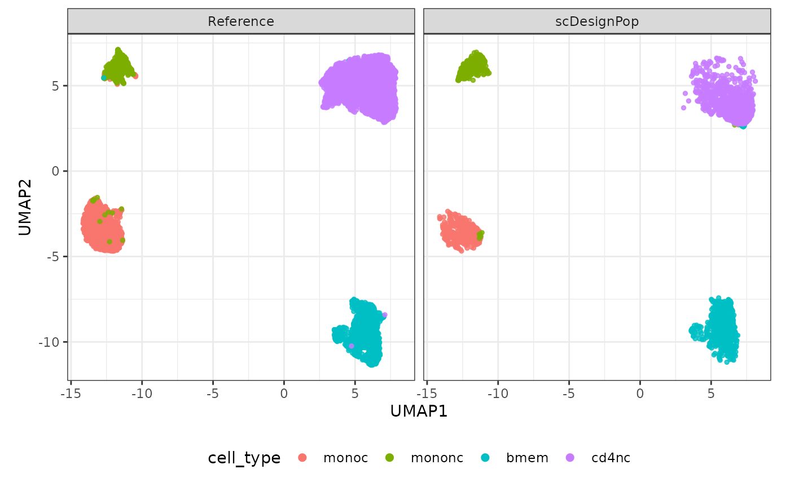

# scDesignPop Quickstart

``` r
library(scDesignPop)
library(SingleCellExperiment)
library(SummarizedExperiment)
library(ggplot2)
theme_set(theme_bw())
```

## Introduction

scDesignPop is a simulator for population-scale single-cell
RNA-sequencing (scRNA-seq) data. For more information, please check the
Articles on our website:
(<https://chrisycd.github.io/scDesignPop/docs/index.html>).

## Step 1: construct a data list

To run scDesignPop, a list of data is required as input. This is done
using the `constructDataPop` function. A `SingleCellExperiment` object
and an `eqtlgeno` dataframe are the two main inputs needed. The
`eqtlgeno` dataframe consists of eQTL annotations (it must have cell
state, gene, SNP, chromosome, and position columns at a minimum), and
genotypes across individuals (columns) for every SNP (rows). The
structure of an example `eqtlgeno` dataframe is given below.

``` r
data("example_sce")
data("example_eqtlgeno")
```

``` r
data_list <- constructDataPop(
    sce = example_sce,
    eqtlgeno_df = example_eqtlgeno,
    new_covariate = as.data.frame(colData(example_sce)),
    overlap_features = NULL,
    sampid_vec = NULL,
    copula_variable = "cell_type",
    slot_name = "counts",
    snp_model = "single",
    celltype_colname = "cell_type",
    feature_colname = "gene_id",
    snp_colname = "snp_id",
    loc_colname = "POS",
    chrom_colname = "CHR",
    indiv_colname = "indiv",
    prune_thres = 0.9
    )
```

## Step 2: fit marginal model

Next, a marginal model is specified to fit each gene using the
`fitMarginalPop` function.  
Here we use a Negative Binominal as the parametric model using `"nb"`.

``` r
marginal_list <- fitMarginalPop(
    data_list = data_list,
    mean_formula = "(1|indiv) + cell_type",
    model_family = "nb",
    interact_colnames = "cell_type",
    parallelization = "pbmcapply",
    n_threads = 20L,
    loc_colname = "POS",
    snp_colname = "snp_id",
    celltype_colname = "cell_type",
    indiv_colname = "indiv",
    filter_snps = TRUE,
    snpvar_thres = 0,
    force_formula = FALSE,
    data_maxsize = 1
    )
```

## Step 3: fit a Gaussian copula

The third step is to fit a Gaussian copula using the `fitCopulaPop`
function.

``` r
set.seed(123, kind = "L'Ecuyer-CMRG")

copula_fit <- fitCopulaPop(
    sce = example_sce,
    assay_use = "counts",
    input_data = data_list[["new_covariate"]],
    marginal_list = marginal_list,
    family_use = "nb",
    copula = "gaussian",
    n_cores = 2L,
    parallelization = "mcmapply"
    )

RNGkind("Mersenne-Twister")  # reset
```

## Step 4: extract parameters

The fourth step is to compute the mean, sigma, and zero probability
parameters using the `extractParaPop` function.

``` r
para_new <- extractParaPop(
    sce = example_sce,
    assay_use = "counts",
    marginal_list = marginal_list,
    n_cores = 2L,
    family_use = "nb",
    indiv_colname = "indiv",
    new_covariate = data_list[["new_covariate"]],
    new_eqtl_geno_list = data_list[["eqtl_geno_list"]],
    data = data_list[["covariate"]],
    parallelization = "pbmcmapply"
    )
```

## Step 5: simulate counts

The fifth step is to simulate counts using the `simuNewPop` function.

``` r
set.seed(123)

newcount_mat <- simuNewPop(
    sce = example_sce,
    mean_mat = para_new[["mean_mat"]],
    sigma_mat = para_new[["sigma_mat"]],
    zero_mat = para_new[["zero_mat"]],
    quantile_mat = NULL,
    copula_list = copula_fit[["copula_list"]],
    n_cores = 2L,
    family_use = "nb",
    nonnegative = TRUE,
    input_data = data_list[["covariate"]],
    new_covariate = data_list[["new_covariate"]],
    important_feature = copula_fit[["important_feature"]],
    filtered_gene = data_list[["filtered_gene"]],
    parallelization = "pbmcmapply"
    )
```

## Step 6: create SingleCellExperiment object using simulated data

After simulating the data, we can create a `SingleCellExperiment` object
as follows.

``` r
simu_sce <- SingleCellExperiment(list(counts = newcount_mat), 
                                 colData = data_list[["new_covariate"]])
names(assays(simu_sce)) <- "counts"

# save gene meta data
rowData(simu_sce) <- rowData(example_sce)
```

## Step 7: visualize using UMAP

The simulated data can be visualized using a UMAP plot as follows.

``` r
logcounts(simu_sce) <- log1p(counts(simu_sce))
set.seed(123)
compare_figure <- scDesignPop::plotReducedDimPop(
    ref_sce = example_sce,
    sce_list = list(simu_sce), 
    name_vec = c("Reference", "scDesignPop"),
    assay_use = "logcounts", 
    if_plot = TRUE, 
    color_by = "cell_type", point_size = 1,
    n_pc = 30)
plot(compare_figure$p_umap)
```



## Session information

``` r
sessionInfo()
#> R version 4.2.3 (2023-03-15)
#> Platform: x86_64-pc-linux-gnu (64-bit)
#> Running under: Ubuntu 22.04.5 LTS
#> 
#> Matrix products: default
#> BLAS:   /usr/lib/x86_64-linux-gnu/openblas-pthread/libblas.so.3
#> LAPACK: /usr/lib/x86_64-linux-gnu/openblas-pthread/libopenblasp-r0.3.20.so
#> 
#> locale:
#>  [1] LC_CTYPE=en_US.UTF-8       LC_NUMERIC=C              
#>  [3] LC_TIME=en_US.UTF-8        LC_COLLATE=en_US.UTF-8    
#>  [5] LC_MONETARY=en_US.UTF-8    LC_MESSAGES=en_US.UTF-8   
#>  [7] LC_PAPER=en_US.UTF-8       LC_NAME=C                 
#>  [9] LC_ADDRESS=C               LC_TELEPHONE=C            
#> [11] LC_MEASUREMENT=en_US.UTF-8 LC_IDENTIFICATION=C       
#> 
#> attached base packages:
#> [1] stats4    stats     graphics  grDevices utils     datasets  methods  
#> [8] base     
#> 
#> other attached packages:
#>  [1] ggplot2_3.5.2               SingleCellExperiment_1.20.1
#>  [3] SummarizedExperiment_1.28.0 Biobase_2.58.0             
#>  [5] GenomicRanges_1.50.2        GenomeInfoDb_1.34.9        
#>  [7] IRanges_2.32.0              S4Vectors_0.36.2           
#>  [9] BiocGenerics_0.44.0         MatrixGenerics_1.10.0      
#> [11] matrixStats_1.1.0           scDesignPop_0.0.0.9009     
#> [13] BiocStyle_2.26.0           
#> 
#> loaded via a namespace (and not attached):
#>  [1] sass_0.4.10            jsonlite_2.0.0         splines_4.2.3         
#>  [4] RhpcBLASctl_0.23-42    bslib_0.9.0            Rdpack_2.6.4          
#>  [7] assertthat_0.2.1       BiocManager_1.30.25    GenomeInfoDbData_1.2.9
#> [10] yaml_2.3.10            numDeriv_2016.8-1.1    pillar_1.10.2         
#> [13] lattice_0.22-6         glue_1.8.0             reformulas_0.4.1      
#> [16] digest_0.6.37          RColorBrewer_1.1-3     XVector_0.38.0        
#> [19] rbibutils_2.3          glmmTMB_1.1.13         minqa_1.2.8           
#> [22] sandwich_3.1-1         htmltools_0.5.8.1      Matrix_1.6-5          
#> [25] pkgconfig_2.0.3        bookdown_0.43          zlibbioc_1.44.0       
#> [28] mvtnorm_1.3-3          scales_1.4.0           lme4_1.1-35.3         
#> [31] tibble_3.2.1           mgcv_1.9-1             generics_0.1.4        
#> [34] farver_2.1.2           cachem_1.1.0           withr_3.0.2           
#> [37] pbapply_1.7-2          TMB_1.9.11             cli_3.6.5             
#> [40] magrittr_2.0.3         evaluate_1.0.3         fs_1.6.6              
#> [43] nlme_3.1-164           MASS_7.3-58.2          textshaping_0.4.0     
#> [46] tools_4.2.3            lifecycle_1.0.4        irlba_2.3.5.1         
#> [49] DelayedArray_0.24.0    compiler_4.2.3         pkgdown_2.2.0         
#> [52] jquerylib_0.1.4        pbmcapply_1.5.1        systemfonts_1.2.3     
#> [55] rlang_1.1.6            grid_4.2.3             RCurl_1.98-1.17       
#> [58] nloptr_2.2.1           rstudioapi_0.17.1      RcppAnnoy_0.0.22      
#> [61] htmlwidgets_1.6.4      labeling_0.4.3         bitops_1.0-9          
#> [64] rmarkdown_2.27         boot_1.3-30            codetools_0.2-20      
#> [67] gtable_0.3.6           R6_2.6.1               zoo_1.8-14            
#> [70] knitr_1.50             dplyr_1.1.4            uwot_0.2.3            
#> [73] fastmap_1.2.0          ragg_1.5.0             desc_1.4.3            
#> [76] parallel_4.2.3         Rcpp_1.0.14            vctrs_0.6.5           
#> [79] tidyselect_1.2.1       xfun_0.52
```
